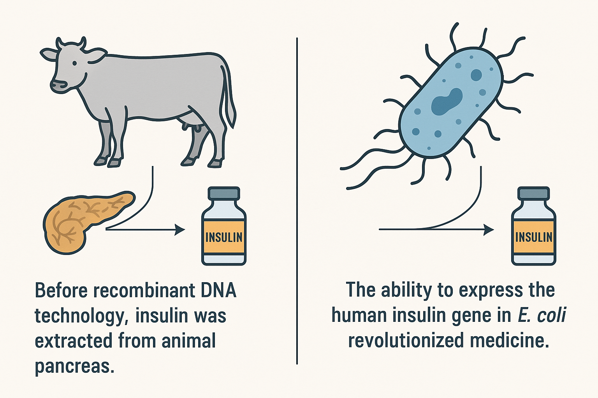
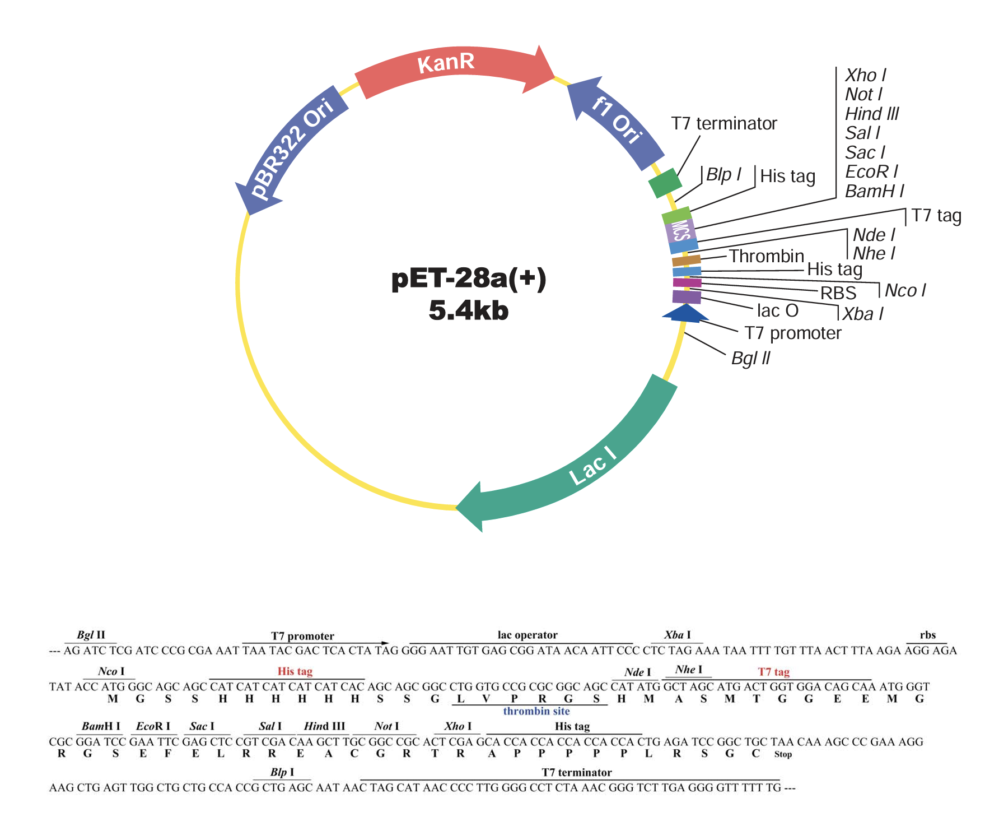
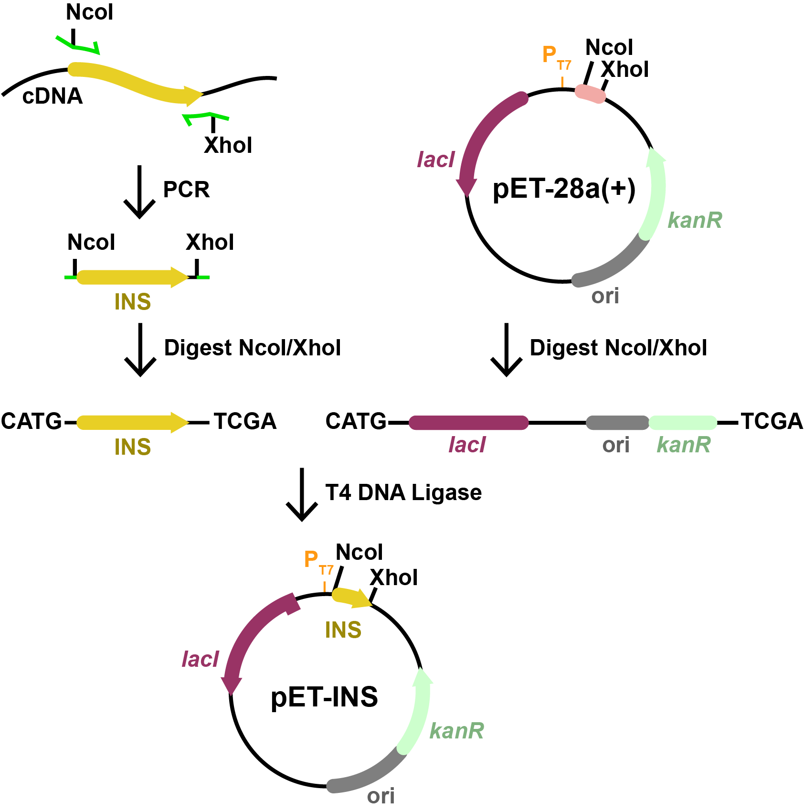

<script src="https://unpkg.com/seqviz"></script>
# Basic Cloning: Overexpression of Human Insulin

## Overview

In this tutorial, you'll learn to design oligonucleotides and plan a traditional restriction/ligation cloning experiment. We'll walk through cloning the human insulin cDNA into a pET expression vector for high-level expression in *E. coli*. This process mimics a landmark achievement in biotechnology: the recombinant production of human insulin, which today powers a multi-billion-dollar global industry.

Insulin was the first therapeutic protein produced using recombinant DNA technology, replacing animal-derived sources and transforming diabetes care. In this example, you’ll see how tools like PCR, restriction enzymes, and plasmid vectors can be used to enable scalable, microbial production of life-saving medicines.

---

## Context: Recombinant Insulin Production

  
*Figure: Before 1982, insulin was extracted from thousands of pig or cow pancreases, yielding limited supply and often triggering immune reactions. Recombinant DNA technology enabled the production of human insulin in *E. coli*, launching a biotechnology revolution. Today, recombinant insulin is a multi-billion-dollar industry and one of the earliest and most successful applications of genetic engineering.*

In this exercise, we’ll simulate how to clone the human insulin CDS from **cDNA**, which is DNA that has been synthesized *in vitro* by reacting mRNA (purified from human cells) with reverse transcriptase. We'll insert it into a pET expression plasmid to produce insulin recombinantly.

---

## The T7 System

  
*Figure: T7 system architecture in BL21(λDE3). IPTG induction lifts LacI repression, allowing expression of both T7 RNA Polymerase (genomically encoded) and the insulin (INS) gene on a pET plasmid under the control of the T7 promoter.*

The **T7 expression system** is a two-level inducible design used for powerful, tightly regulated expression of recombinant proteins in *E. coli* BL21(λDE3).

Here's how it works:

- The BL21(λDE3) genome contains a copy of the **T7 RNA polymerase (T7 RNAP)** gene under control of the **lac promoter** (*Plac*).
- The **pET expression plasmid** carries your gene of interest (e.g., **INS**) downstream of a **T7 promoter** (*PT7*), as well as a **lacI** gene that represses both promoters via **LacO** operator sites.

### Role of IPTG:

In the absence of IPTG:
- The **LacI repressor** binds to LacO sites, preventing transcription from both *Plac* and *PT7*.
- This keeps both **T7 RNAP** and the **target gene** (INS) silent.

Upon IPTG addition:
- IPTG binds to LacI, causing it to dissociate from the DNA.
- **T7 RNAP** is transcribed and translated.
- T7 RNAP then binds to *PT7* on the plasmid and drives high-level expression of the insulin gene.

This modular setup ensures **tight control** (low background, high on-demand expression), which is ideal for producing proteins that may be toxic or burden the host.

---

<!-- 
### 🎥 Watch: Designing and Planning the pET-INS Cloning

Here’s a short video walking through the cloning plan and design of oligos using Ape:

<iframe width="560" height="315" src="https://www.youtube.com/embed/gKHO0HHPsXg" frameborder="0" allowfullscreen></iframe>

--- -->


## Step 1: Choose a Template

We'll use a GenBank record for human insulin cDNA:

- 📄 Insulin cDNA: [Download GenBank](../assets/insulin_cds.seq)  
- 🔗 [NCBI: BC005255.1](https://www.ncbi.nlm.nih.gov/nuccore/BC005255.1)

---

## Step 2: Choose a Vector

We'll use a pET vector with:

- T7 promoter  
- LacI repression system  
- Multiple cloning site (MCS)

- 📄 Starter pET plasmid: [Download GenBank](../assets/pET28a.seq)

  
*Figure: pET-28a(+) vector map showing the T7 promoter and the multiple cloning site (MCS). In this tutorial, we’ll insert the insulin CDS between the **NcoI** and **XhoI** restriction sites for expression under the T7 promoter. Image adapted from [GenScript](https://www.genscript.com/gsfiles/vector-map/bacteria/pET-28a.pdf).*

---


## Step 3: Design PCR Primers

### 🔬 What is an Annealing Region?

In cloning, we use the term **annealing region** to describe the stretch of DNA where a single-stranded oligo or DNA fragment will base-pair with a complementary strand. This occurs in PCR (primers annealing to a template), in Gibson Assembly (fragment overlaps annealing), or in SOEing (stitching adjacent fragments). It’s where the DNA goes from single- to double-stranded as part of the molecular mechanism.

#### Design Guidelines:

- **Length**: 18–25 bp is typical.
- **GC content**: Aim for 40–60% GC.
- **3′ end** (for PCR): Preferably ends in G or C to improve binding and extension.
- **Avoid**: Strong secondary structure, long runs of a single base, or repeats.
- **Tm**: Ideally between 55–65°C and matched between primer pairs.

PCR is generally **forgiving**, especially for standard cloning. You usually don’t have to optimize extensively. Most often, the start or end of your primer is **anchored** to a specific feature (e.g. the start codon), leaving just one floating end to select an 18–25 bp window.

This means you may only have a handful of valid choices—just **pick 20 bp** and move on. It’s usually enough.

You'll see this concept—annealing regions—appear throughout the tutorial series. These basic rules apply regardless of the cloning method.

---

## Visualizing the Cloning Workflow

Before we look at the construction file, let's walk through what's actually happening in this cloning strategy.

The diagram below illustrates how we use PCR, restriction digestion, and ligation to move the insulin coding sequence (INS) into the pET-28a(+) expression plasmid.


*Figure: Cartoon schematic of the pET-INS construction. Each component in the image matches a step in the construction file you'll write next: PCR of the insulin gene, digestion with NcoI/XhoI, and ligation into the pET-28a(+) vector.*

### 🎥 Watch: Walkthrough of the Cloning Plan + Oligo Design in APE

In this short video, we sketch the cloning steps and then walk through how to design the oligos using Ape:

<iframe width="560" height="315" src="https://www.youtube.com/embed/gKHO0HHPsXg" title="Drawing out pET-INS cloning and designing oligos in Ape" frameborder="0" allowfullscreen></iframe>

---

Design primers with:

- A short 5′ tail (5 random bases)  
- A restriction site (NcoI at start, XhoI at end)  
- 18–22 bp annealing region from insulin cDNA

**Primer Structure Example:**
```
Forward primer (ins-F):

  [5' tail] - CCATGG - [18–22 nt from start of insulin ORF]

Reverse primer (ins-R):

  [5' tail] - CTCGAG - [reverse complement of final 18–22 nt of insulin ORF]
```

- CCATGG = NcoI site (includes ATG start codon)
- CTCGAG = XhoI site (downstream of stop codon)

---

## Step 4: Construction File

Here's a complete construction file representing this cloning plan:

```
PCR     ins-F       ins-R       insulin_cDNA     pcr_ins
Digest  pcr_ins     NcoI,XhoI   1                pcr_dig
Digest  pET28a      NcoI,XhoI   1                vec_dig
Ligate  pcr_dig     vec_dig                      pET-INS

oligo   ins-F       ccataCCATGGccctgtggatgcgcctcctg
oligo   ins-R       cagatCTCGAGctagttgcagtagttctccag
```

## Step 5: Simulate the Product

Use your sequence editor or simulation tools (as demonstrated in the earlier video) to predict the outcome of each step in your construction file. For each stage—PCR, digestion, and ligation—verify the resulting sequence.

Pay special attention to the final ligated product:
- Confirm the insert is placed between the NcoI and XhoI sites.
- Ensure the reading frame is preserved.
- Check that the final sequence starts with ATG and ends appropriately.

Once verified, save the final predicted sequence for downstream use or visualization.

---

## Step 6: Visualize the Final Product

- 📄 Final pET-insulin plasmid: [Download GenBank](../assets/pET-INS.seq)

**Product Visualization:**

<div id="viewer1"></div>
<script>
  function waitForSeqViz(callback) {
    if (typeof seqviz !== "undefined" && seqviz.Viewer) {
      callback();
    } else {
      setTimeout(() => waitForSeqViz(callback), 50);
    }
  }

  waitForSeqViz(() => {
    seqviz
      .Viewer("viewer1", {
        name: "pET-INS",
        seq: "AGATCTCGATCCCGCGAAATTAATACGACTCACTATAGGGGAATTGTGAGCGGATAACAATTCCCCTCTAGAAATAATTTTGTTTAACTTTAAGAAGGAGATATACCATGGccctgtggatgcgcctcctgcccctgctggcgctgctggccctctggggacctgacccagccgcagcctttgtgaaccaacacctgtgcggctcacacctggtggaagctctctacctagtgtgcggggaacgaggcttcttctacacacccaagacccgccgggaggcagaggacctgcaggtggggcaggtggagctgggcgggggccctggtgcaggcagcctgcagcccttggccctggaggggtccctgcagaagcgtggcattgtggaacaatgctgtaccagcatctgctccctctaccagctggagaactactgcaactagCTCGAGCACCACCACCACCACCACTGAGATCCGGCTGCTAACAAAGCCCGAAAGGAAGCTGAGTTGGCTGCTGCCACCGCTGAGCAATAACTAGCATAACCCCTTGGGGCCTCTAAACGGGTCTTGAGGGGTTTTTTGCTGAAAGGAGGAACTATATCCGGATTGGCGAATGGGACGCGCCCTGTAGCGGCGCATTAAGCGCGGCGGGTGTGGTGGTTACGCGCAGCGTGACCGCTACACTTGCCAGCGCCCTAGCGCCCGCTCCTTTCGCTTTCTTCCCTTCCTTTCTCGCCACGTTCGCCGGCTTTCCCCGTCAAGCTCTAAATCGGGGGCTCCCTTTAGGGTTCCGATTTAGTGCTTTACGGCACCTCGACCCCAAAAAACTTGATTAGGGTGATGGTTCACGTAGTGGGCCATCGCCCTGATAGACGGTTTTTCGCCCTTTGACGTTGGAGTCCACGTTCTTTAATAGTGGACTCTTGTTCCAAACTGGAACAACACTCAACCCTATCTCGGTCTATTCTTTTGATTTATAAGGGATTTTGCCGATTTCGGCCTATTGGTTAAAAAATGAGCTGATTTAACAAAAATTTAACGCGAATTTTAACAAAATATTAACGTTTACAATTTCAGGTGGCACTTTTCGGGGAAATGTGCGCGGAACCCCTATTTGTTTATTTTTCTAAATACATTCAAATATGTATCCGCTCATGAATTAATTCTTAGAAAAACTCATCGAGCATCAAATGAAACTGCAATTTATTCATATCAGGATTATCAATACCATATTTTTGAAAAAGCCGTTTCTGTAATGAAGGAGAAAACTCACCGAGGCAGTTCCATAGGATGGCAAGATCCTGGTATCGGTCTGCGATTCCGACTCGTCCAACATCAATACAACCTATTAATTTCCCCTCGTCAAAAATAAGGTTATCAAGTGAGAAATCACCATGAGTGACGACTGAATCCGGTGAGAATGGCAAAAGTTTATGCATTTCTTTCCAGACTTGTTCAACAGGCCAGCCATTACGCTCGTCATCAAAATCACTCGCATCAACCAAACCGTTATTCATTCGTGATTGCGCCTGAGCGAGACGAAATACGCGATCGCTGTTAAAAGGACAATTACAAACAGGAATCGAATGCAACCGGCGCAGGAACACTGCCAGCGCATCAACAATATTTTCACCTGAATCAGGATATTCTTCTAATACCTGGAATGCTGTTTTCCCGGGGATCGCAGTGGTGAGTAACCATGCATCATCAGGAGTACGGATAAAATGCTTGATGGTCGGAAGAGGCATAAATTCCGTCAGCCAGTTTAGTCTGACCATCTCATCTGTAACATCATTGGCAACGCTACCTTTGCCATGTTTCAGAAACAACTCTGGCGCATCGGGCTTCCCATACAATCGATAGATTGTCGCACCTGATTGCCCGACATTATCGCGAGCCCATTTATACCCATATAAATCAGCATCCATGTTGGAATTTAATCGCGGCCTAGAGCAAGACGTTTCCCGTTGAATATGGCTCATAACACCCCTTGTATTACTGTTTATGTAAGCAGACAGTTTTATTGTTCATGACCAAAATCCCTTAACGTGAGTTTTCGTTCCACTGAGCGTCAGACCCCGTAGAAAAGATCAAAGGATCTTCTTGAGATCCTTTTTTTCTGCGCGTAATCTGCTGCTTGCAAACAAAAAAACCACCGCTACCAGCGGTGGTTTGTTTGCCGGATCAAGAGCTACCAACTCTTTTTCCGAAGGTAACTGGCTTCAGCAGAGCGCAGATACCAAATACTGTCCTTCTAGTGTAGCCGTAGTTAGGCCACCACTTCAAGAACTCTGTAGCACCGCCTACATACCTCGCTCTGCTAATCCTGTTACCAGTGGCTGCTGCCAGTGGCGATAAGTCGTGTCTTACCGGGTTGGACTCAAGACGATAGTTACCGGATAAGGCGCAGCGGTCGGGCTGAACGGGGGGTTCGTGCACACAGCCCAGCTTGGAGCGAACGACCTACACCGAACTGAGATACCTACAGCGTGAGCTATGAGAAAGCGCCACGCTTCCCGAAGGGAGAAAGGCGGACAGGTATCCGGTAAGCGGCAGGGTCGGAACAGGAGAGCGCACGAGGGAGCTTCCAGGGGGAAACGCCTGGTATCTTTATAGTCCTGTCGGGTTTCGCCACCTCTGACTTGAGCGTCGATTTTTGTGATGCTCGTCAGGGGGGCGGAGCCTATGGAAAAACGCCAGCAACGCGGCCTTTTTACGGTTCCTGGCCTTTTGCTGGCCTTTTGCTCACATGTTCTTTCCTGCGTTATCCCCTGATTCTGTGGATAACCGTATTACCGCCTTTGAGTGAGCTGATACCGCTCGCCGCAGCCGAACGACCGAGCGCAGCGAGTCAGTGAGCGAGGAAGCGGAAGAGCGCCTGATGCGGTATTTTCTCCTTACGCATCTGTGCGGTATTTCACACCGCATATATGGTGCACTCTCAGTACAATCTGCTCTGATGCCGCATAGTTAAGCCAGTATACACTCCGCTATCGCTACGTGACTGGGTCATGGCTGCGCCCCGACACCCGCCAACACCCGCTGACGCGCCCTGACGGGCTTGTCTGCTCCCGGCATCCGCTTACAGACAAGCTGTGACCGTCTCCGGGAGCTGCATGTGTCAGAGGTTTTCACCGTCATCACCGAAACGCGCGAGGCAGCTGCGGTAAAGCTCATCAGCGTGGTCGTGAAGCGATTCACAGATGTCTGCCTGTTCATCCGCGTCCAGCTCGTTGAGTTTCTCCAGAAGCGTTAATGTCTGGCTTCTGATAAAGCGGGCCATGTTAAGGGCGGTTTTTTCCTGTTTGGTCACTGATGCCTCCGTGTAAGGGGGATTTCTGTTCATGGGGGTAATGATACCGATGAAACGAGAGAGGATGCTCACGATACGGGTTACTGATGATGAACATGCCCGGTTACTGGAACGTTGTGAGGGTAAACAACTGGCGGTATGGATGCGGCGGGACCAGAGAAAAATCACTCAGGGTCAATGCCAGCGCTTCGTTAATACAGATGTAGGTGTTCCACAGGGTAGCCAGCAGCATCCTGCGATGCAGATCCGGAACATAATGGTGCAGGGCGCTGACTTCCGCGTTTCCAGACTTTACGAAACACGGAAACCGAAGACCATTCATGTTGTTGCTCAGGTCGCAGACGTTTTGCAGCAGCAGTCGCTTCACGTTCGCTCGCGTATCGGTGATTCATTCTGCTAACCAGTAAGGCAACCCCGCCAGCCTAGCCGGGTCCTCAACGACAGGAGCACGATCATGCGCACCCGTGGGGCCGCCATGCCGGCGATAATGGCCTGCTTCTCGCCGAAACGTTTGGTGGCGGGACCAGTGACGAAGGCTTGAGCGAGGGCGTGCAAGATTCCGAATACCGCAAGCGACAGGCCGATCATCGTCGCGCTCCAGCGAAAGCGGTCCTCGCCGAAAATGACCCAGAGCGCTGCCGGCACCTGTCCTACGAGTTGCATGATAAAGAAGACAGTCATAAGTGCGGCGACGATAGTCATGCCCCGCGCCCACCGGAAGGAGCTGACTGGGTTGAAGGCTCTCAAGGGCATCGGTCGAGATCCCGGTGCCTAATGAGTGAGCTAACTTACATTAATTGCGTTGCGCTCACTGCCCGCTTTCCAGTCGGGAAACCTGTCGTGCCAGCTGCATTAATGAATCGGCCAACGCGCGGGGAGAGGCGGTTTGCGTATTGGGCGCCAGGGTGGTTTTTCTTTTCACCAGTGAGACGGGCAACAGCTGATTGCCCTTCACCGCCTGGCCCTGAGAGAGTTGCAGCAAGCGGTCCACGCTGGTTTGCCCCAGCAGGCGAAAATCCTGTTTGATGGTGGTTAACGGCGGGATATAACATGAGCTGTCTTCGGTATCGTCGTATCCCACTACCGAGATATCCGCACCAACGCGCAGCCCGGACTCGGTAATGGCGCGCATTGCGCCCAGCGCCATCTGATCGTTGGCAACCAGCATCGCAGTGGGAACGATGCCCTCATTCAGCATTTGCATGGTTTGTTGAAAACCGGACATGGCACTCCAGTCGCCTTCCCGTTCCGCTATCGGCTGAATTTGATTGCGAGTGAGATATTTATGCCAGCCAGCCAGACGCAGACGCGCCGAGACAGAACTTAATGGGCCCGCTAACAGCGCGATTTGCTGGTGACCCAATGCGACCAGATGCTCCACGCCCAGTCGCGTACCGTCTTCATGGGAGAAAATAATACTGTTGATGGGTGTCTGGTCAGAGACATCAAGAAATAACGCCGGAACATTAGTGCAGGCAGCTTCCACAGCAATGGCATCCTGGTCATCCAGCGGATAGTTAATGATCAGCCCACTGACGCGTTGCGCGAGAAGATTGTGCACCGCCGCTTTACAGGCTTCGACGCCGCTTCGTTCTACCATCGACACCACCACGCTGGCACCCAGTTGATCGGCGCGAGATTTAATCGCCGCGACAATTTGCGACGGCGCGTGCAGGGCCAGACTGGAGGTGGCAACGCCAATCAGCAACGACTGTTTGCCCGCCAGTTGTTGTGCCACGCGGTTGGGAATGTAATTCAGCTCCGCCATCGCCGCTTCCACTTTTTCCCGCGTTTTCGCAGAAACGTGGCTGGCCTGGTTCACCACGCGGGAAACGGTCTGATAAGAGACACCGGCATACTCTGCGACATCGTATAACGTTACTGGTTTCACATTCACCACCCTGAATTGACTCTCTTCCGGGCGCTATCATGCCATACCGCGAAAGGTTTTGCGCCATTCGATGGTGTCCGGGATCTCGACGCTCTCCCTTATGCGACTCCTGCATTAGGAAGCAGCCCAGTAGTAGGTTGAGGCCGTTGAGCACCGCCGCCGCAAGGAATGGTGCATGCAAGGAGATGGCGCCCAACAGTCCCCCGGCCACGGGGCCTGCCACCATACCCACGCCGAAACAAGCGCTCATGAGCCCGAAGTGGCGAGCCCGATCTTCCCCATCGGTGATGTCGGCGATATAGGCGCCAGCAACCGCACCTGTGGCGCCGGTGATGCCGGCCACGATGCGTCCGGCGTAGAGGATCG",
        annotations: [
          { name: "T7 Promoter", start: 20, end: 40, color: "RosyBrown", direction: 1 },
          { name: "NcoI", start: 105, end: 111, color: "#ff40ff", direction: -1 },
          { name: "INS (insulin CDS)", start: 107, end: 440, color: "#e9cf24", direction: 1 },
          { name: "XhoI", start: 440, end: 446, color: "#ff40ff", direction: 1 },
          { name: "6xHis", start: 446, end: 464, color: "#cc99b2", direction: 1 },
          { name: "T7 terminator", start: 530, end: 578, color: "#bbbbbb", direction: -1 },
          { name: "lacI", start: 4117, end: 5200, color: "#993366", direction: -1 },
          { name: "kanR", start: 1162, end: 1978, color: "#ccffcc", direction: -1 },
          { name: "pMB1 ori", start: 2256, end: 2628, color: "grey", direction: -1 }
        ],
        translations: [{ start: 107, end: 440, direction: 1, name: "Insulin", color: "#e9cf24" }],
        viewer: "both",
        showComplement: true,
        showIndex: true,
        showAnnotations: true,
        showPrimers: false,
        showLabels: true,
        circular: true,
        zoom: { linear: 80 },
        style: { height: "400px", width: "100%" }
      })
      .render();
  });
</script>

---

## Step 7: Validate

- ORF is left-to-right and starts with ATG  
- ORF is in-frame with tags (if any)  
- No internal NdeI or XhoI sites in insert  
- Final construct includes all expected features

---
## Try it yourself

In your quiz, you'll clone a randomly selected gene from the genome of *Bacillus atrophaeus UCMB-5137*.

This gene is a **coding DNA sequence (CDS)**, which means it directly encodes a protein. It's an **open reading frame (ORF)**: a continuous stretch of codons that starts with a **start codon** (like `ATG`) and ends with a **stop codon** (`TAA`, `TAG`, or `TGA`). 

We're giving you only the CDS — not the full gene. That means no promoter, no ribosome binding site (RBS), no terminator, and no replication origin — just the exact stretch of DNA used to encode the protein.  You need to include this entire sequence in your designs.

<div id="geneInfo"></div>
<script>
function waitForProgressManager(callback) {
  if (window.progressManager && typeof window.progressManager.getAssignedGeneDetails === "function") {
    callback();
  } else {
    setTimeout(() => waitForProgressManager(callback), 50);
  }
}

waitForProgressManager(() => {
  const gene = window.progressManager.getAssignedGeneDetails();
  console.log(JSON.stringify(gene, null, 2));
  
  const geneInfo = `
  <h3>Quiz Instructions</h3>
  <p>
    For your quiz, you will clone the CDS from the gene <strong>${gene.name}</strong> 
    (<code>${gene.locus_tag}</code>) from <em>Bacillus atrophaeus UCMB-5137</em>.
  </p>
  <table style="border-collapse: collapse; margin-bottom: 1em;">
    <tr><td style="padding: 4px 8px; font-weight: bold;">Locus Tag:</td><td style="padding: 4px 8px;">${gene.locus_tag}</td></tr>
    <tr><td style="padding: 4px 8px; font-weight: bold;">Protein ID:</td><td style="padding: 4px 8px;">${gene.protein_id}</td></tr>
    <tr><td style="padding: 4px 8px; font-weight: bold;">Location:</td><td style="padding: 4px 8px;">${gene.location}</td></tr>
    <tr><td style="padding: 4px 8px; font-weight: bold;">Length:</td><td style="padding: 4px 8px;">${gene.length} bp</td></tr>
  </table>
  <p>
    🔗 <strong><a href="${gene.genbank_url}" target="_blank">View CDS on NCBI</a></strong>
  </p>
  <p>
    The link above takes you to the region of the full genome containing this CDS. You will use the 
    <strong>exact</strong> ORF sequence shown in that view for your cloning task.
  </p>
  <p>
    Copy and paste the DNA sequence portion of the page into ApE or Benchling and it will clear the spaces and numbers.  You can also download the file by clicking Send to: > File > Genbank.  That file can be opened in your sequence editor and will retain any annotations.
  </p>
  <p>
    Your goal is to design primers that will amplify this ORF for cloning into the NcoI and XhoI 
    sites of the expression plasmid <code>pET-28a(+)</code>. The start codon ATG must 
    <strong>overlap</strong> the ATG embedded in the NcoI site (i.e. the sequence <code>CCATGG</code>).
  </p>
  <p>
    Design your oligos below:
  </p>
`;

  const container = document.getElementById("geneInfo");
  if (container) container.innerHTML = geneInfo;
});
</script>

---

<h3>Cloning Quiz</h3>
<p>Design primers to amplify the selected gene and clone it into pET-28a using NcoI and XhoI.</p>

<form id="quizForm">
  <label><strong>Forward Primer:</strong></label><br>
  Name: <input type="text" id="fwdName" value="pn-F">
  Sequence: <input type="text" id="fwdPrimer" size="60"><br><br>

  <label><strong>Reverse Primer:</strong></label><br>
  Name: <input type="text" id="revName" value="pn-R">
  Sequence: <input type="text" id="revPrimer" size="60"><br><br>

  <label><strong>PCR Product Name:</strong></label><br>
  <input type="text" id="pcrProduct" value="pcr_pn"><br><br>

  <input type="button" value="Check & Generate Construction File" onclick="runQuiz()">
</form>

<div id="feedback" style="margin-top: 1em; font-weight: bold;"></div>

<h4>Construction File:</h4>
<textarea id="cfTextArea" rows="8" style="width: 100%;" readonly></textarea><br>
<button id="copyBtn" onclick="copyCF()">Copy to Clipboard</button>

<script>
let assignedGene = null;

function waitForProgressManager(callback) {
  if (window.progressManager && typeof window.progressManager.getAssignedGeneDetails === "function") {
    callback();
  } else {
    setTimeout(() => waitForProgressManager(callback), 50);
  }
}

waitForProgressManager(() => {
  assignedGene = window.progressManager.getAssignedGeneDetails();
});

document.addEventListener("DOMContentLoaded", () => {
  function runQuiz() {
    // Use the assigned gene for template and construction file
    const fwdSeq = document.getElementById("fwdPrimer").value.trim().replace(/[\s0-9]/g, '');
    const revSeq = document.getElementById("revPrimer").value.trim().replace(/[\s0-9]/g, '');
    const fwdName = document.getElementById("fwdName").value.trim();
    const revName = document.getElementById("revName").value.trim();
    const product = document.getElementById("pcrProduct").value.trim();
    const template = assignedGene ? assignedGene.name : "pn_gene";
    const upperFwd = fwdSeq.toUpperCase();
    const upperRev = revSeq.toUpperCase();

    let feedback = "";
    let pass = true;

    // Validate restriction site presence and spacing
    if (upperFwd.indexOf("CCATGG") === -1) {
      feedback += "⚠️ Forward primer must include the NcoI site (CCATGG)<br>";
      pass = false;
    } else if (upperFwd.indexOf("CCATGG") < 5) {
      feedback += "⚠️ Forward primer must have at least 5 bases before NcoI (CCATGG)<br>";
      pass = false;
    }

    if (upperRev.indexOf("CTCGAG") === -1) {
      feedback += "⚠️ Reverse primer must include the XhoI site (CTCGAG)<br>";
      pass = false;
    } else if (upperRev.indexOf("CTCGAG") < 5) {
      feedback += "⚠️ Reverse primer must have at least 5 bases before XhoI (CTCGAG)<br>";
      pass = false;
    }

    // Annealing region check using positions after restriction sites
    if (assignedGene && assignedGene.sequence) {
      const seq = assignedGene.sequence.toUpperCase();
      const rc = s => s.replace(/./g, c => (
        { A: "T", T: "A", G: "C", C: "G" }[c] || c
      )).split("").reverse().join("");

      const rcSeq = rc(seq);

      // Forward primer annealing region
      const ncoIndex = upperFwd.indexOf("CCATGG");
      if (ncoIndex !== -1) {
        const forAnneal = upperFwd.slice(ncoIndex + 2); // after CCATGG
        if (forAnneal.length < 18 || forAnneal.length > 25) {
          feedback += "⚠️ Forward primer annealing region must be 18–25 bp<br>";
          pass = false;
        } else if (!seq.startsWith(forAnneal)) {
          feedback += "⚠️ Forward primer annealing region does not match start of gene<br>";
          pass = false;
        }
      }

      // Reverse primer annealing region
      const xhoIndex = upperRev.indexOf("CTCGAG");
      if (xhoIndex !== -1) {
        const revAnneal = upperRev.slice(xhoIndex + 6); // after CTCGAG
        if (revAnneal.length < 18 || revAnneal.length > 25) {
          feedback += "⚠️ Reverse primer annealing region must be 18–25 bp<br>";
          pass = false;
        } else if (!rcSeq.startsWith(revAnneal)) {
          feedback += "⚠️ Reverse primer annealing region does not match end of gene (reverse complement)<br>";
          pass = false;
        }
      }
    }

    const pad = (str, len) => str + ' '.repeat(len - str.length);

    // Construction steps — aligned based on column widths
    const stepRows = [
      ["PCR", fwdName, revName, "B_atrophaeus_gen", product],
      ["Digest", product, "NcoI,XhoI", "1", "pcr_dig"],
      ["Digest", "pET28a", "NcoI,XhoI", "1", "vec_dig"],
      ["Ligate", "pcr_dig", "vec_dig", "", "pET-Bat"]
    ];

    // Oligos — align just name column (sequence left free-form)
    const oligoRows = [
      ["oligo", fwdName, fwdSeq],
      ["oligo", revName, revSeq]
    ];

    // Calculate column widths for steps
    const stepColWidths = [];
    stepRows.forEach(row => {
      row.forEach((cell, i) => {
        stepColWidths[i] = Math.max(stepColWidths[i] || 0, cell.length);
      });
    });

    // Format steps
    const formattedSteps = stepRows.map(row =>
      row.map((cell, i) => pad(cell, stepColWidths[i])).join("  ")
    ).join("\n");

    // Format oligos
    const oligoNameWidth = Math.max(fwdName.length, revName.length);
    const formattedOligos = oligoRows.map(row =>
      pad("oligo", 6) + pad(row[1], oligoNameWidth) + "  " + row[2]
    ).join("\n");

    // Combine both
    const formatted = `${formattedSteps}\n\n${formattedOligos}`;
    document.getElementById("cfTextArea").value = formatted;
    if (pass) {
      document.getElementById("feedback").innerHTML = "✅ Primers look valid!";
      if (typeof window.progressManager !== "undefined") {
        window.progressManager.addCompletion("Basic Cloning", "correct");
      }
    } else {
      document.getElementById("feedback").innerHTML = feedback;
    }
  }

  window.runQuiz = runQuiz;

  function copyCF() {
    const textarea = document.getElementById("cfTextArea");
    textarea.select();
    document.execCommand("copy");
    const btn = document.getElementById("copyBtn");
    const original = btn.innerText;
    btn.innerText = "✅ Copied!";
    btn.disabled = true;
    setTimeout(() => {
      btn.innerText = original;
      btn.disabled = false;
    }, 2000);
  }

  window.copyCF = copyCF;
});
</script>

Once you’ve successfully completed the quiz, take a moment to experiment. It won't affect the assignment score. Try removing a 5′ tail, changing an oligo name, or deleting a restriction site. Note what changes break things, and how your changes modify the construction file.