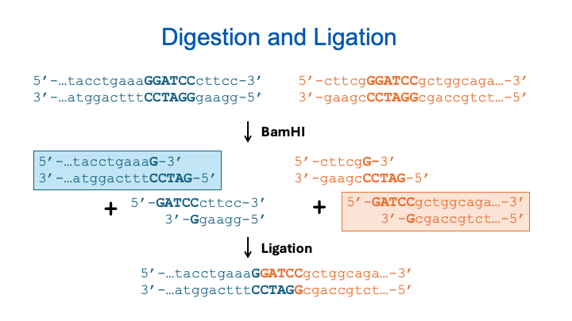

<script src="https://unpkg.com/seqviz"></script>
# Manual Product Prediction

In this module, you'll learn how to predict the results of molecular biology operations by reasoning through the mechanisms. This manual prediction process is foundational for verifying whether a cloning strategy will work as intended. While there are many tools and algorithms to help you design a cloning plan, here we are learning to do it based on first principles. It's a skill you'll often use in the lab when results are unclear and you need to troubleshoot. Going through this process also deepens your understanding of how molecular biology works and how different biochemical elements interact.

---

## Before You Try This...

Want a refresher on how PCR works at a mechanistic level? Watch this short, animated video:  
📺 **[PCR Animation – The Polymerase Chain Reaction](https://www.youtube.com/watch?v=2KoLnIwoZKU)**

---

## Guided Walkthrough: Predicting PCR Products

We’ll begin with a simple scenario using a structured table format called `cf_shorthand`. You’ll encounter this notation in later tutorials, but here we’ll treat it as a straightforward summary of oligos and templates.

### PCR Example

```
operation    primer1      primer2      template    product
PCR          exFor        exRev        pTemp1      pcrpdt

oligo        exFor        CAGCGGATCGGATCGGCGAC
oligo        exRev        CGGTTGTGCGGGCGGAACCAG
plasmid      pTemp1       CTGGTGACCCAGCGGATCGGATCGGCGACCCAAAGCGCCTGGTTCCGCCCGCACAACCGCGA
```

We have two primers (`exFor` and `exRev`) and a circular template plasmid (`pTemp1`). The task is to predict the PCR product.

1. Find `exFor` exactly in the template.
2. Find the reverse complement of `exRev` and match that in the template.
3. The product includes everything between them (including the primers).

**Product Visualization:**

  <div id="viewer1"></div>
  <script>
    function waitForSeqViz(callback) {
      if (typeof seqviz !== "undefined" && seqviz.Viewer) {
        callback();
      } else {
        setTimeout(() => waitForSeqViz(callback), 50);
      }
    }

    waitForSeqViz(() => {
      seqviz
        .Viewer("viewer1", {
            "name": "pcrpdt",
            "seq": "CAGCGGATCGGATCGGCGACCCAAAGCGCCTGGTTCCGCCCGCACAACCG",
            "annotations": [
                { "name": "exFor", "start": 0, "end": 20, "color": "cyan", "direction": 1 },
                { "name": "exRev", "start": 29, "end": 50, "color": "#92ffa4", "direction": -1 }
            ],
          translations: [],
          viewer: "linear",
          showComplement: true,
          showIndex: true,
          style: { height: "75px", width: "100%" }
        })
        .render();
    });
  </script>

---

### PCR with 5' Tails

```
operation    primer1     primer2     template     product
PCR          exFor2      exRev2      pTemp1       pcrpdt2

oligo        exFor2      ccataGAATTCCAGCGGATCGGATCGGCGAC
oligo        exRev2      cagatGGATCCCTGGTTCCGCCCGCACAACCG
plasmid      pTemp1      CTGGTGACCCAGCGGATCGGATCGGCGACCCAAAGCGCCTGGTTCCGCCCGCACAACCGCGA
```

This example includes **5' tails**. Only the 3' ends of primers need to match the template; the 5' ends will be added to the product.

**Product Visualization:**

  <div id="viewer2"></div>
  <script>
    function waitForSeqViz(callback) {
      if (typeof seqviz !== "undefined" && seqviz.Viewer) {
        callback();
      } else {
        setTimeout(() => waitForSeqViz(callback), 50);
      }
    }

    waitForSeqViz(() => {
      seqviz
        .Viewer("viewer2", {
            "name": "pcrpdt",
            "seq": "ccataGAATTCCAGCGGATCGGATCGGCGACCCAAAGCGCCTCGGTTGTGCGGGCGGAACCAGGGATCCatctg",
            "annotations": [
                { "name": "exFor2", "start": 0, "end": 31, "color": "cyan", "direction": 1 },
                { "name": "exRev2", "start": 42, "end": 74, "color": "#92ffa4", "direction": -1 }
            ],
          translations: [],
          viewer: "linear",
          showComplement: true,
          showIndex: true,
          style: { height: "75px", width: "110%" }
        })
        .render();
    });
  </script>

---

### Inverse PCR (IPCR)

<iframe width="560" height="315" src="https://www.youtube.com/embed/SPvvYWmMQ1I" frameborder="0" allowfullscreen></iframe>

In inverse PCR, primers point outward from a circular template.

1. Find forward primer match and set it as new origin.
2. Reverse complement the reverse primer and locate its match.
3. Predict the sequence between these two primer ends.

---

## Quiz: Predict This Product

```
operation    primer1     primer2     template   product
PCR          qFor        qRev        pQ1        quizpdt

oligo        qFor        ccataCATATGGTTCTTGATTCGATACG
oligo        qRev        cagatCTCGAGTTAGTGCTGTTCGAGGTCCTG
plasmid      pQ1         CACTCAAGGTTCAGGACCTCGAACAGCACTAACGGAAGAAATCCGATGGTTCTTGATTCGATACGTGGCCCCGAGGACCTCGCAT
```

<textarea id="pcrQuizInput" rows="4" style="width:100%; font-family:monospace;"></textarea>
<br>
<button onclick="checkPcrQuizAnswer()">Submit</button>
<p id="pcrQuizFeedback"></p>
<script>
function checkPcrQuizAnswer() {
  const correct = "ccataCATATGGTTCTTGATTCGATACGTGGCCCCGAGGACCTCGCATCACTCAAGGTTCAGGACCTCGAACAGCACTAACTCGAGatctg";
  const input = document.getElementById("pcrQuizInput").value.replace(/\s+/g, "");
  const feedback = document.getElementById("pcrQuizFeedback");
  feedback.innerHTML = input.toLowerCase() === correct.toLowerCase()
    ? "✅ Correct! Well done."
    : "❌ Not quite. Check your primer matches and try again.";
}
</script>

---

## Simulating Digestion and Ligation

Now we’ll simulate a restriction digest followed by ligation. You’ll combine DNA pieces with compatible overhangs created by restriction enzymes.

---

### 🖼️ Visual Overview



---

### 📄 Construction File

```
operation    dna      enzyme      fragment    product
Digest       blue     BamHI       0           blue_dig
Digest       orange   BamHI       1           orange_dig

operation    dna1     dna2                    product
Ligate       blue_dig orange_dig              blue_orange

dsDNA        blue         tacctgaaaGGATCCcttcc
dsDNA        orange       cttcgGGATCCgctggcaga
```

This file specifies:
- What DNA is being cut and where
- Which fragments are retained
- Which are ligated

---

### ✂️ Steps 1 and 2: Restriction Digestion

**Enzyme**: BamHI  
**Cut Site**: `G^GATCC` → sticky 5' overhang

Each DNA is cut into two fragments:
- From `blue`, keep fragment 0 (5' half)
- From `orange`, keep fragment 1 (3' half)

These fragments are now `blue_dig` and `orange_dig`.

---

### 🔗 Step 3: Ligation

- `blue_dig` and `orange_dig` have matching GATC overhangs
- They ligate seamlessly via Watson-Crick base pairing
- BamHI site is restored at the junction

---

### 🧬 Final Construct Visualization

**Resulting sequence:**
  <div id="viewer3"></div>
  <script>
    function waitForSeqViz(callback) {
      if (typeof seqviz !== "undefined" && seqviz.Viewer) {
        callback();
      } else {
        setTimeout(() => waitForSeqViz(callback), 50);
      }
    }

    waitForSeqViz(() => {
      seqviz
        .Viewer("viewer3", {
            "name": "pcrpdt",
            "seq": "tacctgaaaGGATCCgctggcaga",
            "annotations": [{ name: "BamHI", start: 9, end: 15, color: "green", direction: 1 }],
          translations: [],
          viewer: "linear",
          showComplement: true,
          showIndex: true,
          style: { height: "75px", width: "110%" }
        })
        .render();
    });
  </script>

---

## 🧪 Quiz: Predict the Ligation Product

```
operation    dna        enzyme      fragment    product
Digest       fragA      XhoI         0          fragA_dig
Digest       fragB      XhoI         1          fragB_dig

operation    dna1       dna2                    product
Ligate       fragA_dig  fragB_dig               fragC

dsDNA        fragA      cagtacaagagattcagCTCGAGatacc
dsDNA        fragB      cgaaaCTCGAGcatagacaggacaacca
```

<textarea id="ligationQuizInput" rows="4" style="width:100%; font-family:monospace;"></textarea>
<br>
<button onclick="checkLigationQuizAnswer()">Submit</button>
<p id="ligationQuizFeedback"></p>

<script>
function checkLigationQuizAnswer() {
  const correct = "cagtacaagagattcagctcgagatagacaggacaacca";
  const input = document.getElementById("ligationQuizInput").value.replace(/\s+/g, "");
  const feedback = document.getElementById("ligationQuizFeedback");
  feedback.innerHTML = input.toLowerCase() === correct.toLowerCase()
    ? "✅ Correct! You've successfully simulated the ligation."
    : "❌ Not quite. Make sure you digested with XhoI and selected the right fragments.";
}
</script>