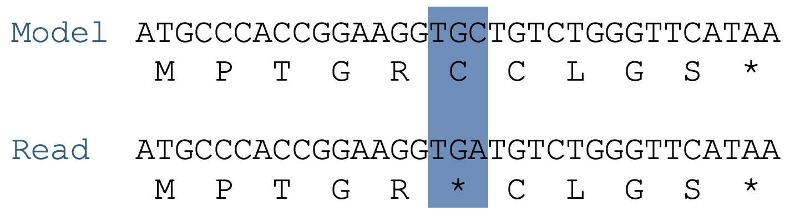
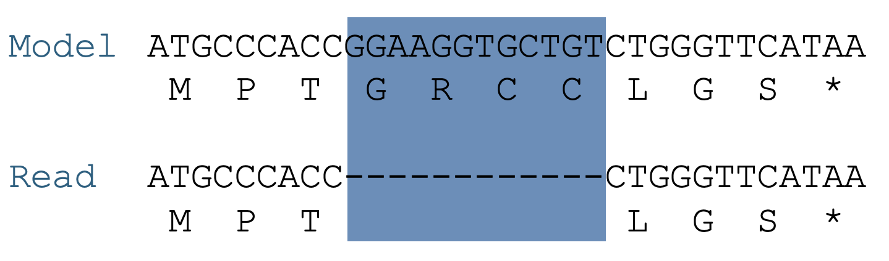
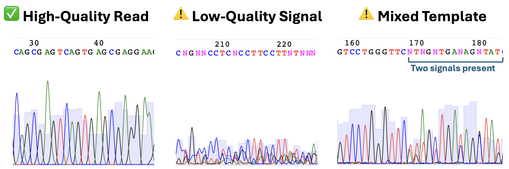

# Sequencing Confirmation

After you've completed your cloning, your next step is to verify the integrity of your plasmid. This tutorial walks through different sequencing strategies and how to choose and apply the right one for your purpose.

---

## Choosing the Right Strategy

There are three main sequencing strategies available, each suited to different goals and budgets:

1. **Cycle sequencing** (like you used in the pP6 experiment) gives a ~1 kb window of high-quality sequence starting about 50 bp downstream of a primer. It's ideal for checking a specific region of a plasmid—like an insert or promoter.
2. **Full-plasmid sequencing** from providers like Plasmidsaurus uses long-read nanopore technology to return the complete sequence of your plasmid. This is more expensive (~$15/sample), but you get the entire plasmid and can catch unexpected rearrangements or background DNA.
3. **NGS** (Next-Generation Sequencing) is a high-throughput approach designed for analyzing complex populations. You PCR-amplify your targets with adapters and submit the pool for deep sequencing. This is powerful, but expensive, and more suitable for library screens than for single plasmid validation.

| Method               | Cost/sample | Output                  | Best For                             |
|----------------------|-------------|--------------------------|----------------------------------------|
| Cycle sequencing     | ~$3.50      | ~1 kb from a primer     | Targeted region confirmation           |
| Full plasmid (Plasmidsaurus) | ~$15        | Entire plasmid sequence | Whole-plasmid verification, structural issues |
| NGS (deep sequencing)| $750+       | Millions of short reads | Large libraries, pooled clone analysis |

📌 *Only cycle sequencing requires you to choose or design a primer. Full plasmid and NGS options use standardized workflows.*

---

### Quiz: Choosing a Sequencing Method

<form id="strategy_quiz_form">
  
<strong>Scenario 1:</strong> You’re confirming that a single new antibiotic resistance gene was cloned correctly into a known plasmid backbone. Which sequencing method should you use?

  <select name="q1">
    <option value="">--Select--</option>
    <option value="cycle">Cycle sequencing</option>
    <option value="plasmidsaurus">Full plasmid (Plasmidsaurus)</option>
    <option value="ngs">NGS</option>
  </select>
  

  
<strong>Scenario 2:</strong> You’ve made a library of 5,000 variants of a ribosome binding site in a plasmid and want to determine the distribution of sequences present. What’s the right method?

  <select name="q2">
    <option value="">--Select--</option>
    <option value="cycle">Cycle sequencing</option>
    <option value="plasmidsaurus">Full plasmid (Plasmidsaurus)</option>
    <option value="ngs">NGS</option>
  </select>
  

  
<strong>Scenario 3:</strong> You’re validating the structure of a new multi-gene construct with internal repeats and want to ensure the whole thing is intact and mutation-free. Best method?

  <select name="q3">
    <option value="">--Select--</option>
    <option value="cycle">Cycle sequencing</option>
    <option value="plasmidsaurus">Full plasmid (Plasmidsaurus)</option>
    <option value="ngs">NGS</option>
  </select>
  

  <button type="button" id="strategy_submit_btn">Check Answers</button>
</form>

## Designing Your Primer (Cycle Sequencing Only)

If you're using cycle sequencing, you must provide a primer. This primer must bind upstream of the region you wish to confirm.

- The sequencing read begins ~50 bp downstream of the primer.
- You can use standard primers (e.g., M13rev, G00101), but only if your target region lies ~50 bp downstream of their site.
- Otherwise, design a custom primer:
  - Length: 18–25 bp
  - GC content: ~40–60%
  - Avoid long repeats or secondary structure
  - Must match the strand in the direction you wish to read

**Important:** Plasmid sequences are circular. In GenBank files, the “start” of the sequence is arbitrary. A feature near the beginning (like the T7 promoter) may require you to rotate the sequence to design a primer “upstream” of it, even if that’s technically the end of the GenBank string.

---

### Quiz: Primer Design for T7 + INS

Download the plasmid: [⬇️ pET-INS.seq](../assets/pET-INS.seq)

Your goal: Design a 20 bp oligo that will allow a sequencing read to start at the **T7 promoter** and cover the **INS gene**.

Paste your oligo sequence below (5' to 3', exact match to template strand):

<form id="primer_quiz_form">
  <input type="text" name="primer" id="primer_input" size="60" />
  

  <button type="button" id="primer_submit_btn">Check Primer</button>
</form>

---

## Defining the Confirmation Target

Before you can interpret your sequencing results, you need to define the **confirmation target**—the specific region of the plasmid you care about confirming. The choice of this region depends on how much certainty you need about the sequence, and what can already be inferred from functional outcomes (e.g., antibiotic resistance, visible fluorescence, or selection as from an activity screen). As a rule of thumb, the confirmation target is a **subsequence of the full plasmid model** that includes:

- Any inserted or deleted regions
- Any modified regulatory elements (e.g., promoters, RBSs)
- Any junctions created by cloning
- Any regions you targeted for mutagenesis

### Case Study: pET-INS

For the pET-INS plasmid:

- The kanamycin resistance (**kanR**) and the origin of replication (**ori**) are inherited from the original pET28a vector. Since you selected colonies on a kanamycin plate, these must be functional. Even if they contain silent mutations, they won't affect your experiment, so they don’t need to be reconfirmed.
- The confirmation target is the **T7 promoter, RBS, and INS gene**, along with enough flanking sequence to include sites of oligo binding during construction.

This entire block—the T7 + RBS + INS insert—is the **confirmation region**, and it is treated as a whole. The sequencing read must cleanly and correctly cover this entire region to confirm the plasmid’s correctness.

Once you’ve defined your confirmation target, your task is to determine whether your sequencing read contains it accurately and completely. This involves aligning your read to the model plasmid and checking whether the confirmation region is covered and error-free.

---

## Analyzing Sequencing Data

To evaluate your sequencing outcome, you’ll align your sequencing read to the reference model and examine how well it covers your defined confirmation target.

### Performing an Alignment

Use **ApE** or **Benchling** to perform sequence alignment:

- In ApE: Open both the read and the model plasmid. Go to `Tools → Align Sequences...`, select both files, and click OK.
- In Benchling: Use the alignment tool in the side panel to align your sequencing read to the model plasmid.
- You can also use any of various webtools like https://en.vectorbuilder.com/tool/sequence-alignment.html

Look for:

- **Start of alignment**: Does the read begin at the expected point downstream of your primer?
- **Full coverage** of the confirmation target
- **Perfect match** or any **deviations**

If the confirmation target is entirely within the read, then it is 'perfect' and you are done with the analysis.  Otherwise, there may be a mutation present.

### Types of Sequence Deviations

#### Point mutations
These are single base changes. In open reading frames (ORFs), they fall into three categories:

- **Silent**: The codon is changed, but the same amino acid is encoded.
- **Missense**: The codon is changed to encode a different amino acid.
- **Nonsense**: The codon is changed to a stop codon, truncating the protein.

If you find a single base difference between your sequencing read and the confirmation target within an ORF, translate the surrounding region in both the read and the model to determine whether the mutation is silent, missense, or nonsense.

*Figure: Example of a **nonsense mutation**. In the model, the codon **TGC** codes for cysteine (C). In the read, a point mutation changes it to **TGA**, a stop codon (\*), truncating the protein. This is a single base change with a major functional consequence.*

#### Indels
Insertions or deletions (indels) can be especially problematic in ORFs. If not in multiples of 3, they cause frameshifts, scrambling the downstream protein sequence. Even a single base insertion or deletion can shift the reading frame, changing every amino acid after the mutation and often introducing a premature stop codon. Indels in regulatory regions or non-coding areas may have less dramatic effects but can still disrupt motifs or regulatory elements.

*Figure: Example of an **indel mutation**. The model contains a region coding for multiple amino acids. In the read, this region is deleted, leading to a frameshift. All downstream codons are shifted, likely disrupting the entire ORF.*

| Deviation Type    | Description                                      | Effect in ORFs                   | Effect in Regulatory Regions        | Effect in Non-Coding           |
|-------------------|--------------------------------------------------|----------------------------------|------------------------------------|-------------------------------|
| Exact Match       | No differences                                   | ✅ Ideal                         | ✅ Ideal                           | ✅ Ideal                       |
| Silent Mutation   | Codon changes, same amino acid                   | Usually benign                   | May affect motif behavior          | None                          |
| Missense         | Codon changes, new amino acid                    | May change function              | Not applicable                     | None                          |
| Nonsense         | Creates stop codon                               | Likely disruptive                | Not applicable                     | None                          |
| Indel            | Insertion/deletion; may cause frameshift         | Frameshift if not multiple of 3; severe | May disrupt motifs/regulatory elements | Sometimes none               |
| Frameshift       | Insertion/deletion disrupting codons (not by 3)  | Severe                           | Not applicable                     | None                          |
| Regulatory change | Affects promoter, RBS, etc.                      | Not applicable                   | Can disrupt expression             | None                          |
| Structural error  | Duplication, truncation, or wrong orientation    | Varies                           | Varies                             | Varies                        |

### Quality Issues

Sometimes you can’t interpret the read because:

- **Ns or ambiguous bases**: Signal dropout or primer failure
- **Short reads**: May not reach the confirmation target
- **Mixed signals**: More than one DNA template in the reaction

*Figure: Sequencing trace types. Left: **High-Quality Read** — Tall, sharp peaks with clear base calls. Middle: **Low-Quality Signal** — Short, noisy peaks with Ns and base ambiguity. Right: **Mixed Template** — From around base 169, each position shows two well-resolved peaks, suggesting the presence of two DNA templates in the same prep. Mixed reads indicate either two different plasmids in the cell, or instability of the original plasmid.  Either way, it is problematic.*

### Final Call Categories

You must assess the read and decide:

- **Perfect**: All of the confirmation region is covered with high-quality data, and there are no mismatches.
- **Perfect Partial**: What you can see is perfect, but part of the confirmation region is not covered due to read length or quality limitations.
- **Mutant**: Read has deviations in the confirmation target.
- **Mixed Clone**: Trace shows evidence of multiple sequence populations—typically due to more than one plasmid being present in the miniprep prep.
- **Failed**: Poor quality read, unreadable, or no match to target.

---

### Quiz: Sequence Interpretation

Download the full quiz data set here:  

 [⬇️ Download All Cases (ZIP)](../assets/sequence_cases.zip)

Each folder in the zip includes:

- A `.ab1` trace
- A `.txt` read
- A `.gb` model with the confirmation region annotated

---

<h3>Case 1: missense_in_ORF</h3>

What kind of outcome is shown in this sequencing result?

<select id="q_case1">
  <option value="">--Select scenario--</option>
  <option value="perfect">Perfect</option>
  <option value="perfect_partial">Perfect Partial</option>
  <option value="mixed">Mixed</option>
  <option value="failed">Failed</option>
  <option value="silent_mutation">Silent Mutation</option>
  <option value="nonsense_mutation">Nonsense Mutation</option>
  <option value="missense_mutation">Missense Mutation</option>
  <option value="indel">Indel</option>
</select>

<button type="button" id="check_case1">Check Answer</button>

<h3>Case 2: perfect_partial</h3>

What kind of outcome is shown in this sequencing result?

<select id="q_case2">
  <option value=">--Select scenario--</option>
  <option value="perfect">Perfect</option>
  <option value="perfect_partial">Perfect Partial</option>
  <option value="mixed">Mixed</option>
  <option value="failed">Failed</option>
  <option value="silent_mutation">Silent Mutation</option>
  <option value="nonsense_mutation">Nonsense Mutation</option>
  <option value="missense_mutation">Missense Mutation</option>
  <option value="indel">Indel</option>
</select>

<button type="button" id="check_case2">Check Answer</button>

<h3>Case 3: perfect</h3>

What kind of outcome is shown in this sequencing result?

<select id="q_case3">
  <option value="">--Select scenario--</option>
  <option value="perfect">Perfect</option>
  <option value="perfect_partial">Perfect Partial</option>
  <option value="mixed">Mixed</option>
  <option value="failed">Failed</option>
  <option value="silent_mutation">Silent Mutation</option>
  <option value="nonsense_mutation">Nonsense Mutation</option>
  <option value="missense_mutation">Missense Mutation</option>
  <option value="indel">Indel</option>
</select>

<button type="button" id="check_case3">Check Answer</button>

<h3>Case 4: indel</h3>

What kind of outcome is shown in this sequencing result?

<select id="q_case4">
  <option value=">--Select scenario--</option>
  <option value="perfect">Perfect</option>
  <option value="perfect_partial">Perfect Partial</option>
  <option value="mixed">Mixed</option>
  <option value="failed">Failed</option>
  <option value="silent_mutation">Silent Mutation</option>
  <option value="nonsense_mutation">Nonsense Mutation</option>
  <option value="missense_mutation">Missense Mutation</option>
  <option value="indel">Indel</option>
</select>

<button type="button" id="check_case4">Check Answer</button>

