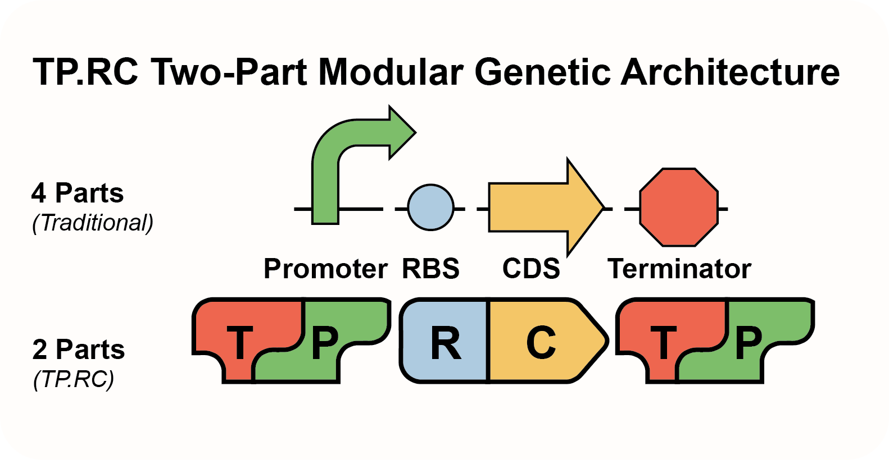
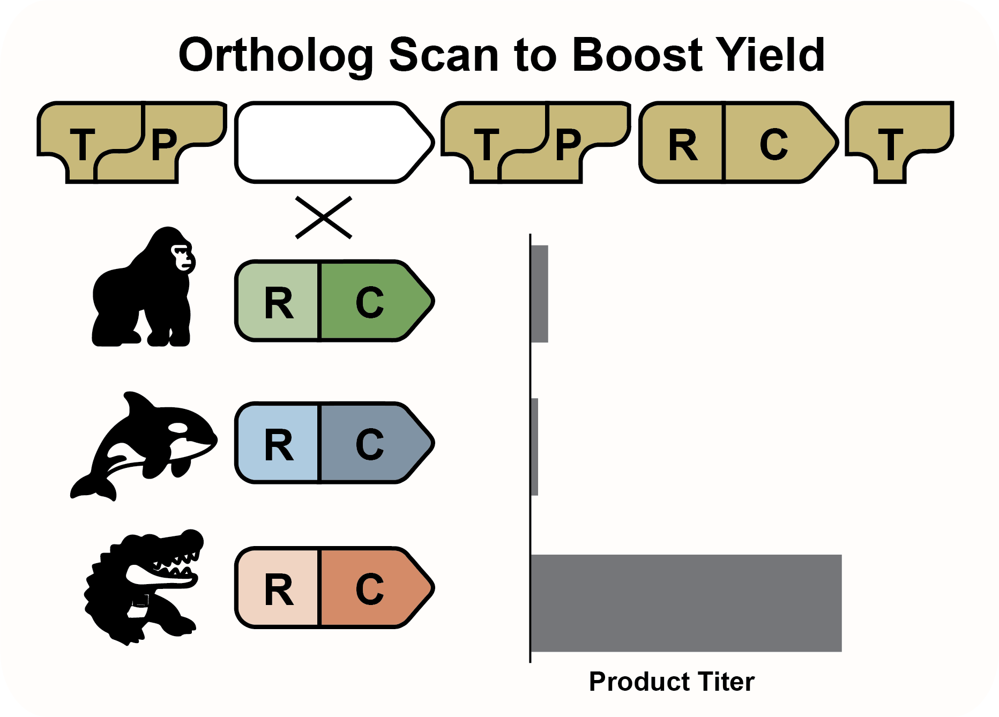
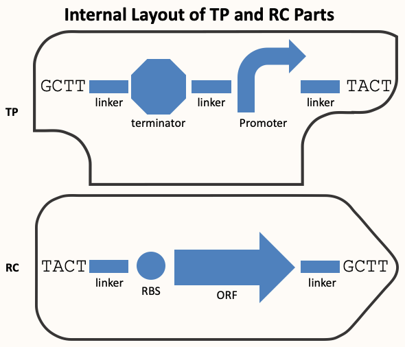

# Experimental Design Principles

Construction Files, Genbank sequences, and LabSheets are a general-purpose toolkit for documenting synthetic biology experiments. They do not tell you *what* to build—only *how to record it*. So the fundamental question at the start of every project is: **What should you build and test?**

## Types of Experiments

Most synthetic biology experiments fall into two broad categories:

### 1. Prototyping

In the prototyping stage, you are exploring new designs that haven't been tested in your system. You might have:

- A gene from a database or literature

- A new combination of parts

- A hypothesis about how something will work in a cell

But no direct experience with the function in your hands.

#### Questions to Ask:
- What proteins/RNAs need to be expressed?

- What regulatory elements do I need?

- What assay tells me if it works?

- What controls are required for interpreting results?

- How many variants can I build/test given assay throughput?

### 2. Optimization

Once a prototype is functional, optimization improves performance: yield, growth, stability, etc.

#### Strategies:

- **Promoter Swap**: Replace a promoter with variants

- **RBS Library**: Tune translation rate

- **Ortholog Scan**: Swap homologous coding sequences

- **Terminator Scan**: Adjust transcript stability

- **Part Combination Screens**: Combine multiple part variants

In our example, **Lycopene33** is an optimization experiment in which we replace the existing dxs gene in a multi-gene biosynthetic pathway with orthologous dxs genes from other organisms to assess the impact on pathway performance.

The relationship between prototyping and optimization can be thought of as a progression: prototyping produces a first working construct, and optimization refines it for better performance.

*Figure: A decision tree illustrating the progression from untested design to prototype, and from prototype to systematic part tuning and performance analysis. Optimization is an iterative process—improvements identified in each round are incorporated into the next cycle, refining the design over time. In contrast, prototyping is a more linear process aimed at achieving first functionality.*  

## The TP.RC System

To simplify modular cloning, we group parts into two classes: Traditionally, gene expression units are built using four modular parts: Promoter, RBS, CDS, and Terminator. Each of these must be mixed and matched individually during optimization, resulting in long repetitive assemblies. The TP.RC system simplifies this by collapsing the four parts into two composite modules: TP (Terminator-Promoter) and RC (RBS-CDS). This reduces the number of interchangeable parts, standardizes junctions, and enables efficient assembly of expression units using fewer, more functional blocks.

*Figure: The TP.RC model replaces traditional 4-part gene units with streamlined 2-part modules. Each TP and RC part corresponds to untranscribed and transcribed regions of DNA, respectively—rather than neatly mapping to a single gene. This architecture enables construction of multicistronic operons by placing multiple RC units in sequence, and allows changes to transcriptional architecture via singular additions or removals of TP parts. The reduced part count simplifies optimization while preserving full design flexibility.*

## Planning an Optimization Experiment

In practice, optimization is often performed without a specific hypothesis about what part is limiting. Instead, it is a form of sensitivity analysis—each position in a construct is systematically tested for influence on performance. Rather than identifying a bottleneck beforehand, you vary elements (e.g., promoters, RC units) at selected sites and measure the resulting impact. This allows you to discover which parts are rate-limiting or overly active and informs future engineering steps.

The typical optimization workflow involves:

1. Selecting a position in the construct to diversify

2. Choosing a part type to vary (e.g., promoter, RC unit)

3. Designing a panel of alternative sequences

4. Building variants using Construction Files

5. Running assays and interpreting results

6. Updating designs based on observed trends

These small focused scans yield interpretable results and inform future designs.

## Ortholog Scans and RC Replacement

An ortholog scan is a type of RC swap. The goal is to replace an existing RBS-CDS module with alternative homologs of the same protein from other organisms. Each ortholog is paired with a designed RBS to form a new RC unit.

In practice:

- You identify target orthologs using BLAST

- Design or adapt RBSs

- Clone them into the backbone using Golden Gate or Gibson

*Figure: A biosynthetic pathway made of multiple TP.RC units is shown. In this ortholog scan, a single RC unit is replaced with variants sourced from gorilla, orca, and alligator. Expression output (product titer) is quantified at right. The alligator ortholog significantly outperforms the others, demonstrating how targeted RC swaps can boost pathway productivity.*

## Anatomy of TP and RC Parts

The TP.RC system follows a standardized layout compatible with the MoClo Golden Gate standard. Each part includes flanking type IIS restriction sites and 5 bp overhangs that define junctions and ensure consistent assembly order.

The diagram below illustrates the structure of TP and RC parts, showing BsaI sites, MoClo overhangs, and internal linkers for amplification and sequencing.

### TP (Terminator-Promoter) Parts
These combine a terminator from the previous gene with a promoter for the next one. The TP unit terminates transcription upstream and initiates transcription downstream. The sequence is flanked by linkers and BsaI sites to facilitate cloning.  There is also a 3rd unique linker between the promoter and terminator that serves as a site for sequencing over the promoter-RBS junction in the final construct.

### RC (RBS-CDS) Parts
These include a ribosome binding site and a coding sequence. The cassette is flanked by unique linker elements to facilitate modification of adjacent parts and terminated by BsaI sites on both ends.

Each linker (sometimes also called a spacer) is a unique 20 bp DNA sequence chosen for its uniqueness and suitability for priming PCR. These regions are often derived from validated qPCR primer sets and placed at fixed positions in each part.

These linkers allow:

- Reliable cycle sequencing from fixed, well-placed anchor points

- Selective amplification of the backbone via PCR to modify individual parts

- Homology regions for Gibson, SOEing, or Yeast recombination-based cloning

*Figure: Layout of TP and RC parts showing the role of unique linkers and MoClo overhangs. Each part includes type IIS flanking sites and 5' overhangs for ordered assembly.*

## Quiz: Building an RC Part

Given the following design inputs, construct a valid RC part sequence for Golden Gate assembly. Use the following conventions:

- 5' BsaI site (recall you need 1 more base between this and the sticky end): `GGTCTC`

- MoClo overhangs (sticky ends): `tact` (5') and `gctt` (3')

- 5' Spacer: `CAAATGTACGGCCAGCAACG`

- 3' Spacer: `GCACACCGTGGAAACGGATG`

- RBS: `gagaaagaggagaaatactag`

- CDS (start to stop): `ATGGCGTCTGACAGGAGCGTAA`

- Don't forget to add 5 bp tails on both ends of the DNA!

### ✍️ Enter your RC part sequence here:
<textarea id="rcInput" rows="5" style="width: 100%;"></textarea> 
<button id="rcQuizBtn">Check Answer</button>

When designing synthetic biology experiments using the TP.RC system, you don’t need to make early decisions about exactly how each part will be used. As long as you follow the conventions for TP and RC design—using appropriate placed unique linkers, BsaI sites, and standardized overhangs—you can easily mix and match parts later. RC and TP units can be swapped, reordered, added, or removed without redesigning the parts. This flexibility simplifies both prototyping and optimization workflows.

There are multiple valid strategies for constructing TP and RC parts. You can order them as synthetic gene blocks (GBlocks) with overhangs and tails already included, clone them from genomic DNA or existing plasmids using primers that append the necessary BsaI sites, or obtain them through clonal gene synthesis. Regardless of the method, the outcome is the same: a reusable TP or RC module that integrates seamlessly into modular assemblies, enabling rapid iteration and design reuse.
