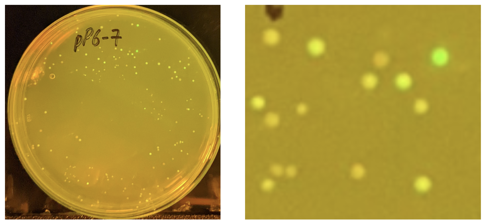

 # pP6 Intro: Finding Strong Promoters in E. coli
 
 This tutorial introduces the pP6 wetlab experiment, which you will perform to identify strong sigma70 promoters in *E. coli*. You’ll be using saturation mutagenesis and golden gate assembly to build a small promoter library and screen the variants for activity.
 
 ## Goal of the Experiment
 
 Your objective is to create and test a library of synthetic promoters to discover variants with high transcriptional strength. Each variant in the library will contain the strong consensus sigma70 promoter motifs (TTGACA at -35, TATAAT at -10) but will differ in the flanking sequences. These differences may influence promoter strength in surprising ways.
 
 ## Background: Transcription in E. coli
 
   
 *Figure: RNA polymerase initiates transcription at the +1 site after binding to the -35 and -10 boxes.*
 
 When RNA polymerase binds to a promoter in *E. coli*, it begins transcription at the +1 position, synthesizing an mRNA strand. This mRNA includes a ribosome binding site (RBS) and a coding sequence (CDS). The -10 and -35 sequences upstream of the +1 site strongly influence transcription strength.
 
 ## Sigma70 Consensus Promoters
 
 Most constitutive *E. coli* promoters are recognized by sigma70, which binds to the following consensus sequences:
 
 - **-35 box**: TTGACA  
 - **-10 box**: TATAAT
 
 Promoters that match this consensus sequence closely are very strong. In this course, we’ll refer to exact matches as **consensus promoters** (formerly called “UBER promoters”).
 
 ## The J23100 Promoter Family
 
 An earlier study generated the J23100 promoter family by introducing mutations into the -35 and -10 boxes while keeping flanking sequences constant. This yielded ~20 variants with known relative strengths. But because the flanking sequence is constant, these promoters are repeated and prone to recombination.
 
 ## The pP6 Library Design
 
 To discover new strong promoters, we reverse the J23100 experiment:
 
 - Fix the -35 and -10 consensus motifs.
 - Randomize the surrounding sequence using degenerate oligos.
 
 ```
 ttgacaNNNNNNNNNNNNNNNNNtataatNNNNNN
 ```
 
 We also add 4 random bases upstream and downstream, yielding 31 degenerate positions in total.
 
 ## Construction File
 
 We synthesize a promoter library using a PCR-based Golden Gate protocol (also known as EIPCR). The primers are:
 
 ```
 >P6libF  
 ccaaaggtctcATTATANNNNNNNNNNNNNNNNNTGTCAANNNNGAacccaggactcctcgaagtcgttcttaagacaac  
 
 >P6libR  
 cagttGGTCTCAATAATNNNNNNANNNNGTtagtatttctcctcgtctacggttaactgatactc  
 ```
 
 **Construction File:**
 
 ```
 PCR     P6libF   P6libR     pTP1       P6
 Digest  P6       BsaI       1          P6cut
 Ligate  P6cut    —                      pP6
 ```
 
 (Optionally, pP6-7F can be used as a template.)
 
 ## Expected Outcome
 
 The product of the reaction is a circular plasmid with a unique randomized promoter upstream of an amilGFP reporter.
 
 Each colony on your transformation plate represents a unique promoter. When exposed to blue light, colonies fluoresce with varying intensity depending on promoter strength.
 
   
 *Figure: A plate of pP6 variants under blue light, showing different levels of GFP fluorescence.*
 
 ## Picking Colonies and Sequencing
 
 You’ll select the brightest colonies (most green) for follow-up:
 
 1. Grow in liquid culture
 2. Miniprep DNA
 3. Submit for Sanger sequencing
 4. Analyze the sequence to identify the promoter
 
 Note: Smaller, slow-growing colonies might encode the strongest promoters. Don’t skip them!
 
 ## Getting Started
 
 1. Download the pP6 lab sheets and sequences:  
    [Google Drive - pP6 Materials](https://drive.google.com/drive/folders/16-0ek2biyB-hI1RY2xgW6p4fe32FbAJh)
 
 2. Make a copy of this spreadsheet:  
    [pP6 LabSheet Workbook](https://docs.google.com/spreadsheets/d/1updHzk3CJ2_L7eO-Abg0cpHQleU7c8b0lbF9QmNzFWA/edit?usp=sharing)
 
 3. Fill in your name and ID, and print the lab worksheets for:
    - PCR
    - Gel
    - Zymo
    - Assembly
    - Transformation
    - Colony picking
    - Miniprep
    - Sequencing
    - Sequence Analysis
 
 4. Watch the demo video before each lab activity.
 
 ## Demo Videos (on bCourses)
 
 - pP6-2022-1-PCR  
 - pP6-2022-2-Gel  
 - pP6-2022-3-Zymo  
 - pP6-2022-4-Assembly  
 - pP6-2022-5-Transformation  
 - pP6-2022-6-Pick  
 - pP6-2022-7-Miniprep  
 - pP6-2022-8-Sequencing  
 - pP6-2022-9-Sequence Analysis
 
 ## Next
 
 When you're ready, proceed to the [Pipetting tutorial](pp6_pipetting.md) to learn how to use a micropipette correctly before starting wetlab work.