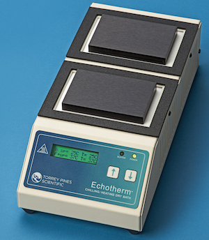

# EchoTherm Chilling/Heating Dry Bath (Torrey Pines IC22)

The EchoTherm dry bath provides two independently controlled plates for chilling and heating samples. It is primarily used for heat shock protocols, allowing precise temperature control on each plate.

## Access

No additional certification or supervisor approval is required to use the EchoTherm. Anyone with lab_safety certification may operate this instrument.

## Default Use

The main role of the EchoTherm is for heat shock procedures.

- Flip the toggle switch on (located at the back right corner).
- Wait until the display temperatures match the setpoints: 4 °C for the front plate and 42 °C for the back plate.
- The default settings are already programmed.

## Adjusting Temperatures

It is acceptable to change the temperature settings for other tasks; however, users must reset the plates to 4 °C (front) and 42 °C (back) when finished.

- Press the up and down arrows simultaneously to toggle between the Front (F) and Back (B) plates.
- An arrow on the display indicates which plate is currently selected.
- Use the up/down arrows to adjust the temperature for the selected plate.

## Shutdown

After use, toggle the power switch off.
