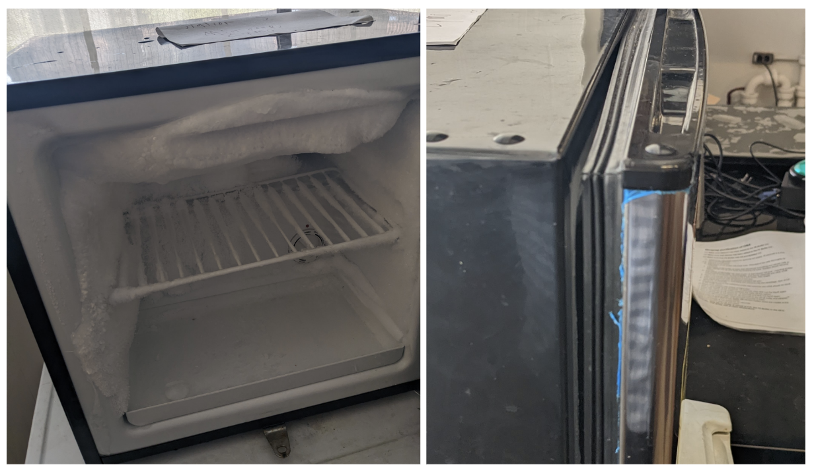

&#9888;&#65039; WARNING: This tutorial is for SUPERVISORS ONLY! &#9888;&#65039;

# –80 °C Freezer Training (CAT#: 79-200 Haier Biomedical Ultra Low Freezer)

 A –80 °C freezer is used for storage of microbial stocks, competent cells, and protein preps. **Only authorized supervisors may operate or access this freezer.**

**Model:** CAT#: 79-200 Haier Biomedical Ultra Low Freezer

---

## Access Rules

- **Supervisors Only:** This freezer is restricted to supervisors or designated personnel. Unauthorized access is not permitted.

---

## Temperature Policy

- The freezer **must always remain at –80 °C**. **Never adjust the set temperature.**
- **Do not open the freezer if the internal temperature is above –75 °C.** Wait for the temperature to recover before accessing.

---

## Vacuum Seal Behavior

- After closing the freezer door, a **vacuum forms** to maintain the ultra-low temperature.
- **Do NOT force the door open** immediately after closing. Wait several minutes for the vacuum to release naturally.
- Forcing the door risks bending the handle or yanking it off entirely.

---

## Seals and Ice Buildup

- **Always inspect the door gaskets** and seals before and after use. A tight seal is critical for maintaining –80 °C.
- **Frost or ice buildup** on the seal or inside the door is a warning sign of leaks or improper closing.

- If you observe ice or frost, **carefully remove it** using a plastic scraper or gloved hand. Do not use metal tools.
- **Never leave the door ajar**. A –80 °C freezer will “burn itself out” (overwork and fail) if the seal is not maintained.

---

## Sample Handling

- **All items must be clearly labeled** with strain or plasmid names. Spelling must be correct and unambiguous.
- **Every new or removed sample must be logged** in the [GitHub repository inventory](https://github.com/) (use the lab’s inventory repo).
- **Tubes must be tightly sealed and labeled** (waterproof, cold-resistant labels recommended).

---

## Personal Protective Equipment (PPE)

- **Thermal gloves are required** for all freezer operations. These are stored atop the device.
- Gloves protect your hands from severe cold burns.

---

## Good Practices

- **Minimize door opening.** Plan your sample retrieval in advance.
- **Return items promptly** and check that everything is properly sealed and organized.
- **Never leave the door open while searching**—remove racks or boxes to a bench, then close the door until ready to return.

---

## Alarms and Emergencies
### If an alarm sounds

- Immediately check the display for the alarm type.
- **Contact JCA and/or the Stanley facilities emergency number** as soon as possible.
- Do not attempt repairs.

### Alarm Types
The Haier freezer alarms include audible buzzers and visible flashing lights to alert users immediately. The display panel shows specific error codes (E0–E4) for sensor malfunctions or other issues. Below is a summary of common alarm types, their triggers, and how they appear on the display:

| Alarm Type         | Trigger Condition                 | Display Indicator            |
|--------------------|---------------------------------|-----------------------------|
| High Temperature   | Internal temp above set threshold | Temperature value flashing  |
| Low Temperature    | Internal temp below set threshold | Temperature value flashing  |
| Door Ajar          | Door left open for extended time  | "Door" icon flashing        |
| Power Failure      | Loss of main power supply         | "Power" icon flashing       |
| Sensor Error (E0–E4) | Sensor malfunction or disconnection | Error code displayed (E0–E4) |

- For detailed information on alarm types, troubleshooting, and maintenance, supervisors are encouraged to consult the full Haier Biomedical Ultra Low Freezer manual available here: [Haier Manual PDF](https://geneseesci.asset.akeneo.cloud/Technical_Documents/media/1362.pdf).

---

# Quiz

Test your understanding of the –80 °C Freezer procedures. For each statement, mark it as **True** or **False**. You must answer all correctly to pass. If you miss any, you can try a new randomized set.

  <form id="minus80_quiz_form">
    

    

      <button id="minus80_submit_btn" type="submit">Submit</button>
      <button id="minus80_reset_btn" type="button" style="margin-left: 0.5em;">Reset</button>
      
    

  </form>

After passing the quiz, log in and submit your report to be certified.