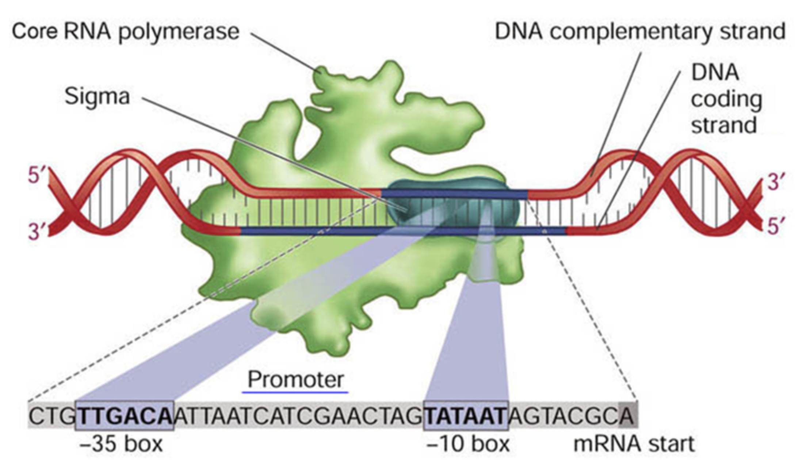

# Engineering a Scientific Presentation

This tutorial guides you through a structured approach to creating a presentation for a project.
---

## 1) One idea per slide
This single rule defines your entire approach. Every slide should express one idea. You should be able to summarize it in one simple sentence. When you draft your talk, start by writing those sentences first, each one representing a slide. Then examine how they connect into a full narrative.

The first step is to just write. Don’t worry about slides or structure—just free write or talk through your story. Imagine you’re explaining it to a person, or even to an AI, and capture every idea as it comes. You can even turn on a transcription service to record you answering the question "Tell me about your project".

Once you have a rough narrative, start breaking it apart into individual points. You can think of these as the raw material for slides. You rewrite each sentence of your verbal narrative as a simplified bullet.

At this stage, it’s normal to have too much. That’s fine. Go through what you wrote and separate it into many small statements with each expressing one idea. Later, you’ll group, merge, or trim them down to find the right level of granularity for your talk.

The goal is to end up with a sequence of ideas that each stand alone, but also build naturally into a coherent story. Those individual ideas become your slides.

## 2) Identify your audience and their baseline understanding
Before you can communicate effectively, you must know what your audience already knows.

**Example:**
Let’s say you want to explain pP6 to people with one year of college science background. Assume they understand high-school level chemistry and biology, but may not have mastered them. They likely know replication, transcription, and translation at a basic level but nothing more specific.

If you are presenting to professors, you might assume more. But for a student presentation to peers, always build from familiar concepts. Your narrative should connect every new idea to something they already understand.

For *pP6*, you might need slides that introduce:

- Promoter strength and structure
- Synthetic promoters and why they matter
- Degenerate oligos and library design
- Screening approaches and data interpretation

Each of these ideas can be expressed as a clear sentence, then turned into one slide.

---

## 3) Identify the granularity of the story
Start with a verbose sentences.

**Example draft bullets:**
- Every gene starts with a promoter and they have different strengths.
- Strength relates to the -35 and -10 sequences and their spacing.
- Families like J23119 capture that variation.
- We want to make more promoters like these.
- We can build a synthetic library using degenerate oligos.
- That requires EIPCR and a GFP reporter.
- We screen colonies for brightness.

That’s your raw material. Next, prune it.

Estimate one to two minutes per slide. If you have six minutes, aim for three content slides. Combine related bullets into higher-level ideas:

1. Promoter variation and why we want stronger parts.
2. Building a synthetic promoter library and how it’s made.
3. Screening and finding new strong promoters.

---

## 4) Making the slides
If you are reading this, you are probably new to communicating in a presentation format. At this stage of development, keep things simple to focus on the narrative and clarity of your talk. A simple black or colored text on a white background is all you need. While dark backgrounds and institutional branding graphics can look polished when done well, they often aren’t handled cleanly. If you use a dark background, most white-background graphics will look awkward when pasted onto it. Keeping everything on white makes it much easier to achieve clean, consistent slides.

### Consistency and titles
You want your slides to look consistent. Titles should have similar font sizes and roughly the same word length. Start by creating a blank white slide and decide how to capture the *idea* of the slide in 1–5 words. The title doesn’t need to state the idea in detail—it just needs to orient the audience. For example, a slide explaining the -35/-10 aspects of a promoter might have the title **“Bacterial Promoter Structure.”** It abstracts the idea but still gives the audience the right expectation for what the slide covers.

### Visual communication
Next, think about how to visually express the concept. In the -35/-10 promoter example, you can often find openly licensed (for example, Creative Commons) illustrations that already express this idea. Use these only if their license allows reuse and always provide visible credit. Many scientific figures online—especially from journals—are copyrighted and cannot be reused publicly without permission. If you’re creating slides for class or internal lab meetings, limited use of such figures can fall under educational fair use, provided the original work is clearly cited.

When searching for images, look for ones that match the level of detail you need. For instance, if you search for “E. coli promoter sigma70,” you’ll find many illustrations. Some are too detailed, like the first example below, which shows more than you need to explain the basic -35/-10 structure. A simpler diagram, like the second example, conveys the right level of granularity.

  <a href="https://media.springernature.com/lw1200/springer-static/image/art%3A10.1186%2Fgb-2003-4-1-203/MediaObjects/13059_2003_Article_617_Fig2_HTML.jpg" target="_blank">
    View detailed promoter diagram (Smith *et al.*, 2003, *Genome Biology*)
  </a>
    
  

  <small>
    “Consensus promoter diagram,” adapted from <a href="https://bio.libretexts.org/Bookshelves/Microbiology/Microbiology_(Boundless)/07%3A_Microbial_Genetics/7.19%3A_RNA-Based_Regulation/7.19E%3A__Regulation_of_Sigma_Factor_Translation" target="_blank">LibreTexts Microbiology</a>, licensed under 
    <a href="https://creativecommons.org/licenses/by-nc-sa/4.0/" target="_blank">CC BY-NC-SA 4.0</a>.
  </small>

When referencing specific data or figures from a publication, use the original figure with proper attribution. If the design or level of detail is not suitable for your purpose, redraw it clearly in your own style and include a note such as “Adapted from Smith *et al.*, 2003.” This respects both copyright and scholarly integrity.

### Presenting experimental results
When presenting experimental results, your slide’s main element should be the data itself—plates, gels, charts, or images. Unlike in papers, you should label key features directly on the graphic instead of relying on a caption. This helps your audience immediately understand what they’re looking at.

### Visual flow
Consider the flow of each slide. If there’s only one main image, there’s no problem. But if there are multiple elements—images, graphs, or text boxes—the viewer’s eye should follow a clear, logical path. Arrange elements so that the audience intuitively reads them in the order you’ll discuss them. If the slide’s visual structure is confusing, your audience will focus on deciphering it rather than listening to you. For data-heavy slides, include simple annotations or arrows that direct attention to the key insights.

### Animations
Animations are a powerful way to illustrate multi-step processes, especially in molecular biology or protocols where change over time is the key concept. They provide a visual way to show *how* something happens, not just *what* it is.

For example, to explain promoters, you might start with a DNA sequence showing the -35 and -10 regions, then animate a sigma factor binding to those sites, followed by RNA polymerase attaching to sigma, and finally RNA synthesis beginning. This type of animation visually walks your audience through the sequence of events that define the process.

Use animations when understanding a sequence of events is essential to your story. Implement them so that each progression is triggered by a click. This lets you control pacing and synchronize your narration with the visuals. These slides are often the easiest to present because they naturally break your explanation into small, sequential sub-ideas.

However, use animations judiciously. When the idea is familiar or simple, an animation can distract rather than clarify. But when explaining something complex and multi-step, it’s often your best tool for making the process comprehensible.

---

## 5) Narrate your slides
Students almost always include too much text. It feels safer, but it makes communication harder. Your audience reads instead of listens, and you end up reading your own slides.

**Better approach:**
- Use visuals: cartoons, data, workflows, or photos that you can narrate.
- One idea per slide; state it succinctly in the title.
- Use text sparingly—only to anchor the idea.
- Avoid complete sentences unless quoting or defining.

If you must use bullet slides, ensure each bullet is essential. But for science storytelling, visual explanation almost always works better.

---

## 6) Narrate your slides
You should not need a script while presenting, but writing one during preparation helps.

Use the slide notes section to write out how you’ll explain each slide. Read these notes before the presentation to reinforce the flow. Don't memorize them, just reconstitute your understanding of the idea in your mind.

Writing the narration:

- Forces you to think through the logic of each slide.
- Helps you recall transitions between ideas.
- Serves as a study or reference aid later.

When presenting, don’t read. You’ll naturally phrase things differently, and that’s fine. The goal is to internalize the story so you can talk through it conversationally.