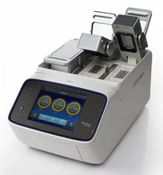

# ProFlex PCR System (3×32‑Well Variant)

## Documentation & References

- [User Guide](https://assets.fishersci.com/TFS-Assets/LSG/manuals/MAN0007697.pdf)  
- [Product Page](https://www.fishersci.com/shop/products/proflex-pcr-system-extended-warranty-package-3-x-32-well-5/4484073)  

## Overview & Purpose

The ProFlex PCR System is a thermal cycler designed for polymerase chain reaction (PCR) applications. This tutorial focuses on the 3×32-well variant, which features three independently controlled 32-well blocks allowing simultaneous runs with different protocols. The tutorial covers sample loading, program creation and editing, running and monitoring PCR cycles, adjusting the heated lid, and lab-specific best practices to ensure optimal performance and safety.

## Sample Loading & Setup

- Use PCR tubes or strips. 
- Always place the 3×32 retainer on the block before loading samples to ensure proper positioning and heating.  
- Align tubes carefully within the retainer to avoid misplacement or damage.  
- Close the lid firmly and properly to ensure good thermal contact and prevent evaporation.

## Creating & Editing Programs (Methods)

- Use the **New Method** option to create a PCR program from scratch.  
- Alternatively, use **Open Template** to load pre-existing protocols for editing or reuse.  
- Select blocks individually or together to assign different thermal cycling profiles.  
- Edit stages by specifying temperatures, hold times, and cycle numbers.  
- Utilize the VeriFlex feature to program different temperatures for each of the three blocks simultaneously.  
- Save methods after editing to preserve changes.  
- Use simulation options to verify program steps and timing before running.

## Running & Monitoring

- Start runs by selecting the desired method and blocks.  
- View real-time progress on the instrument’s dials and display.  
- Monitor temperature profiles and cycle counts during the run.  
- Export run reports and data for record-keeping and analysis.

## Lid / Heated Cover Adjustment

- The ProFlex system includes a heated lid to prevent condensation on tube caps.  
- Ensure the 3×32 retainer and blocks are seated properly before closing the lid.  
- If lid pressure seems insufficient, use the knob on top of the heated cover to raise or lower the lid. Turn clockwise to increase pressure and counterclockwise to decrease pressure until tubes are firmly sealed without being crushed.
- If tubes are not aligning correctly, check that the 3×32 retainer is seated flat on the block and reposition if necessary.

## Lab‑Specific Rules & Best Practices

- Always end PCR programs with a 16 °C hold to preserve samples.  
- Supervisors or instructors must remove all samples daily and transfer them to white plastic boxes stored in the enzyme freezer.  
- Reset instrument settings to defaults if any adjustments were made during runs.  
- Backup and restore saved methods regularly to prevent data loss.

## Safety & Maintenance Notes

- Always unplug the instrument before cleaning or maintenance.  
- Allow the instrument to cool before performing any cleaning.  
- Use compressed air to clean the block surface and remove debris.  
- Run the instrument’s self-verification procedure regularly to ensure proper function.  
- Calibration and repairs should only be performed by trained service personnel.

## Summary: Essential Steps

| Task                  | Key Points                                                                                 |
|-----------------------|--------------------------------------------------------------------------------------------|
| Sample Loading        | Use PCR tubes/strips with 3×32 retainer; align tubes; close lid properly.                  |
| Method Setup          | Create new or open templates; select blocks; edit stages; use VeriFlex; save and simulate. |
| Editing Programs      | Modify stages, temperatures, cycles; verify before running.                                |
| Lid Adjustment        | Check retainer/block seating; adjust lid height if needed for proper heating.              |
| Final Hold            | End programs with a 16 °C hold step.                                                       |
| Sample Removal        | Remove samples daily; store in enzyme freezer boxes; reset settings if changed.            |
