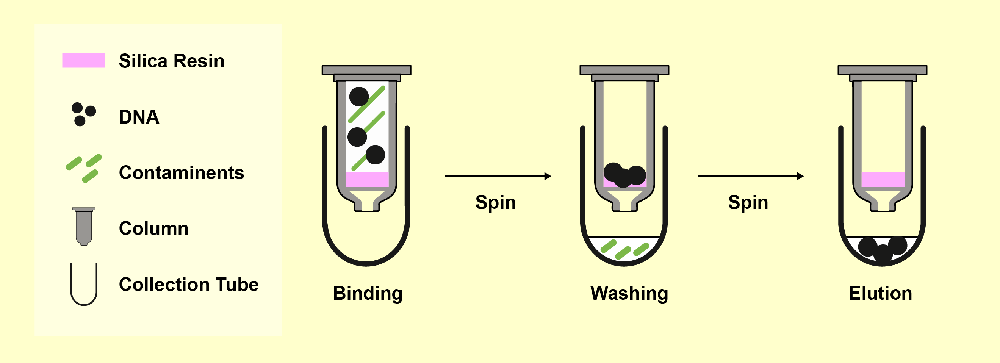

# Zymo Cleanup

After confirming your PCR reaction on a gel, the next step is to purify the DNA. This is essential for most cloning workflows, especially **Golden Gate** and **restriction enzyme-based** cloning. Although it is **optional for Gibson**, cleanup helps remove components from the PCR that may interfere with downstream steps.

---

## Why Cleanup Is Necessary

PCR reactions contain:

- Unreacted dNTPs
- Active polymerase
- Buffers and salts

These can interfere with cloning enzymes, particularly enzymes like BsaI that generate sticky ends. Polymerase can fill in sticky overhangs, preventing proper ligation. Cleanup eliminates these components.

---

## How It Works

*Figure: Binding of DNA to the silica membrane, washing away contaminants, and elution with EB buffer.*
DNA binds to silica in the presence of a chaotropic salt—usually **guanidinium thiocyanate**—found in Zymo's **ADB buffer**. This same chemical also denatures proteins like polymerases.

The basic workflow:

1. Mix PCR product with **ADB buffer**
2. Pass through a **silica column** by centrifugation
3. Wash the column with **70% ethanol** (provided as PE or Wash buffer)
4. Dry the column by spinning
5. Elute DNA with water or **EB Buffer**

> EB is preferred because it's a low-pH buffer. Pure water can absorb CO₂ and become slightly acidic, which may reduce recovery of DNA.

> Be mindful: **know where your DNA is at each step.** Many errors involve discarding the DNA by accident.

---

## Zymo vs. Other Kits

We use the **Zymo DNA Clean & Concentrator-5** kit because it allows elution in as little as **6 µL**, which is sometimes useful for concentrating the DNA.

Alternative: **Qiagen QIAquick Gel Extraction Kit (purple column)**  

- Typically used to extract DNA from excised gel slices  
- Requires special buffer if binding from a gel  
- Similar silica-based chemistry

> Note: for small DNA fragments (<250 bp), improve binding by mixing **1 part ADB + 3 parts isopropanol** before loading.

---

## Lab Sheet Overview

**Title:** TPcon6-P6: Zymo  
**Location of PCR product:** Enzyme freezer, PCR rack labeled “to Zymo”

| Reaction | Tube Label | Side Label | Elution Volume | Destination      |
|----------|------------|------------|----------------|------------------|
| 79       | z79        | P6 z79     | 25 µL          | zymos1/___       |

Each PCR reaction you process will yield a new **labeled Eppendorf tube** with your cleaned-up DNA.

---

## Step-by-Step: Regular Zymo Cleanup

This protocol removes polymerase, dNTPs, salts, and oligos from your PCR. It also works for cleaning up restriction digests.

1. Add **180 µL of Zymo ADB buffer** (brown bottle) to your PCR reaction.
2. Transfer the mixture to a **Zymo column** (small clear tube labeled for cleanup).
3. Spin at full speed for **15 seconds**, discard the flow-through.
4. Add **200 µL of PE Buffer** to the column.
5. Spin at full speed for **15 seconds**, discard the flow-through.
6. Add another **200 µL of PE Buffer**.
7. Spin at full speed for **15 seconds**, discard the flow-through.
8. Spin at full speed for **90 seconds** to dry the column, discard flow-through.
9. Place the column in a clean 1.5 mL Eppendorf tube. Add the elution volume (see lab sheet) of **EB Buffer** or water **directly to the center** of the column matrix. Avoid letting liquid stick to the walls.  
10. Spin at full speed for **45 seconds** to collect your purified DNA.

---

## 🎥 Watch Before Lab

Watch the Zymo cleanup tutorial video before coming to lab.

<iframe width="560" height="315" src="https://www.youtube.com/embed/gKHO0HHPsXg" frameborder="0" allowfullscreen></iframe>
