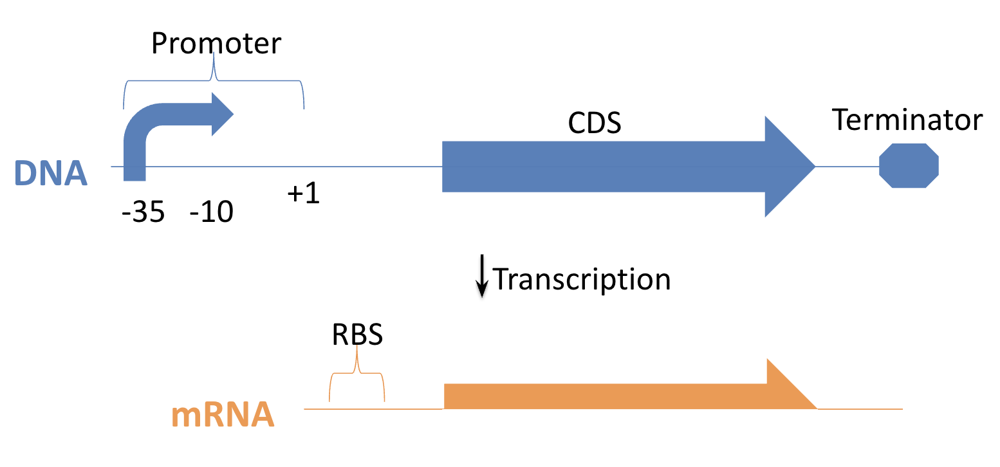
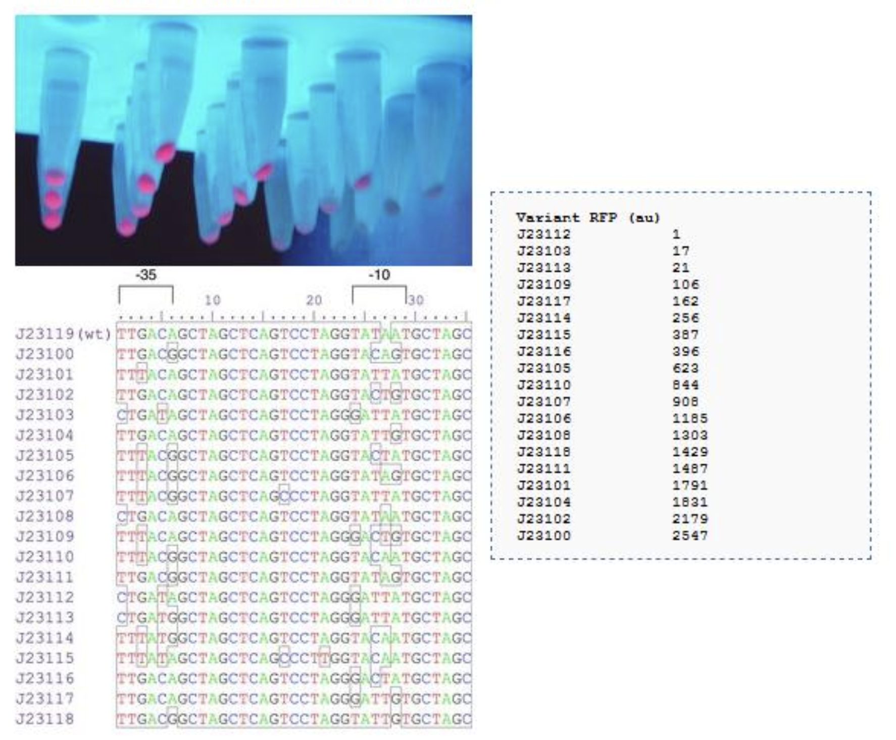
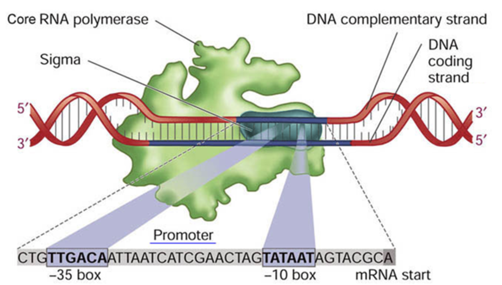

<script src="https://unpkg.com/seqviz"></script>
# pP6 Intro: Finding Strong Promoters in *E. coli*

## Goal of the Experiment

Your objective is to create and test a library of synthetic promoters to discover variants with high transcriptional strength. The goal is to create a family of distinct promoter parts that span a range of strengths, suitable for use in multi-gene constructs without sequence redundancy or recombination risk.

## Background: Transcription in *E. coli*


*Figure: Transcription in E. coli. RNA polymerase binds the promoter at the -35 and -10 sites, initiates at +1, and transcribes a coding sequence (CDS) into mRNA with an RBS. The transcript ends at a terminator sequence.*

When RNA polymerase binds to a promoter in *E. coli*, it begins transcription at the +1 position, synthesizing an mRNA strand. This mRNA includes a ribosome binding site (RBS) and a coding sequence (CDS). The -10 and -35 sequences upstream of the +1 site strongly influence transcription strength.

## The J23100 Promoter Family

Years ago, a standard set of synthetic promoters was developed by mutating a parent sequence called J23119. This set, known as the J23100 promoter family, provides a spectrum of expression strengths and has proven very useful for fine-tuning gene expression.

These promoters are ideal when you want to scan through different expression levels of the same gene using well-characterized sequences. Each member of the family was created by introducing mutations into the -35 and -10 boxes of J23119, while keeping the flanking sequence constant.


*Figure: The J23100 promoter family. Variants were created by mutating the -35 and -10 regions while keeping flanking sequences constant. Fluorescence and sequence alignment show relative expression strengths.*

## Why Build New Promoter Libraries?

Although the J23100 family is widely used, it has some limitations:

- All promoters share a nearly identical sequence backbone, making them prone to homologous recombination when used together in a single plasmid.
- Repeating these sequences interferes with PCR-based edits and makes cloning less reliable.

To overcome these issues, we aim to build multiple promoter families with similar activity ranges—but based on entirely distinct sequences. These new libraries can be used together safely in the same construct and facilitate more advanced synthetic biology designs.

## The pP6 Library Design

The pP6 experiment is designed to generate a sixth-generation promoter library following this strategy.

We retain only the minimal motifs required for strong σ⁷⁰ recognition and randomize all other surrounding bases. This allows us to create new promoters that are strong, functional, and non-redundant.

- Fix the -35 and -10 consensus motifs.
- Randomize all other positions.


*Figure: σ⁷⁰ consensus promoter. The sigma factor of RNA polymerase recognizes the -35 (TTGACA) and -10 (TATAAT) boxes and initiates transcription at the +1 site. This image shows the promoter region unwound and engaged by polymerase.*

We also add 4 random bases upstream and downstream, yielding 31 degenerate positions in total.


<div id="viewer_fwd"></div>
<script>
  function waitForSeqViz(callback) {
    if (typeof seqviz !== "undefined" && seqviz.Viewer) {
      callback();
    } else {
      setTimeout(() => waitForSeqViz(callback), 50);
    }
  }

  waitForSeqViz(() => {
    seqviz
      .Viewer("viewer_fwd", {
        "name": "Consensus Promoter Pattern",
        "seq": "NNNNttgacaNNNNNNNNNNNNNNNNNtataatNNNNNNaNNNN",
        "annotations": [
          { "name": "-35", "start": 4, "end": 10, "color": "turquoise", "direction": 1 },
          { "name": "-10", "start": 27, "end": 33, "color": "turquoise", "direction": 1 },
          { "name": "+1", "start": 39, "end": 40, "color": "turquoise", "direction": 1 }
        ],
        "translations": [],
        "viewer": "linear",
        "showComplement": true,
        "showIndex": true,
        "style": { "height": "120px", "width": "100%" }
      })
      .render();
  });
</script>

## Construction File

We use a "construction file" to formally describe how DNA parts are assembled. Each line represents a biochemical reaction step using standardized syntax.

The pP6 promoter library is built using a two-step process involving PCR and Golden Gate assembly.

We begin by amplifying the entire plasmid using a protocol called EIPCR (Exponential Inverse PCR), where each primer includes a constant 3′ annealing region and a 5′ overhang containing degenerate bases that introduce variability into the promoter region:

**Primers:**
```
>P6libF2
CAGTAggtctcgATAATNNNNNNANNNNGTTAGTATTTCTCCTCGTCTAC

>P6libR2
CCAAAggtctcgTTATANNNNNNNNNNNNNNNNNTGTCAANNNNGAACCCAGGACTCCTCGAAGTC
```

**Construction File Format (copy-paste compatible):**

```
# PCR reaction
# step      primer1     primer2     template     product
PCR         P6libF2     P6libR2     pJ12         P6

# Golden Gate assembly
# step          dna         enzyme     product
GoldenGate      P6          BsaI       pP6
```

Each resulting pP6 plasmid contains a unique, randomized promoter upstream of an amilGFP reporter gene.

## Expected Outcome

The product of the reaction is a circular plasmid with a unique randomized promoter upstream of an amilGFP reporter.

Each colony on your transformation plate represents a unique promoter. When exposed to blue light, colonies fluoresce with varying intensity depending on promoter strength.

  
*Figure: A pP6 transformation plate under blue light, showing colonies that express varying levels of GFP due to differences in promoter strength. The highlighted region is zoomed in to reveal diverse green intensities among clones, even though all share the core consensus motif. This illustrates the wide range of activities produced by flanking sequence variation—J23119 is unusually strong for this pattern.*


## Picking Colonies and Sequencing

You’ll select the brightest colonies (most green) for follow-up:

1. Grow in liquid culture
2. Miniprep DNA
3. Submit for Sanger sequencing
4. Analyze the sequence to identify the promoter

Note: Smaller, slow-growing colonies might encode the strongest promoters. Don’t skip them!

## Getting Started

1. Download the pP6 lab sheets and sequences:  
   [Google Drive - pP6 Materials](https://drive.google.com/drive/folders/16-0ek2biyB-hI1RY2xgW6p4fe32FbAJh)

2. Make a copy of this spreadsheet:  
   [pP6 LabSheet Workbook](https://docs.google.com/spreadsheets/d/1updHzk3CJ2_L7eO-Abg0cpHQleU7c8b0lbF9QmNzFWA/edit?usp=sharing)

3. Fill in your name and ID, and print the lab worksheets.  You may also use your phone, tablet, or notebook.  You may also write out your own versikon.

4. Read the tutorial and Watch the demo videos before each lab activity.

## All Demo Videos

****** replace with new vids as links
- pP6-2022-1-PCR  
- pP6-2022-2-Gel  
- pP6-2022-3-Zymo  
- pP6-2022-4-Assembly  
- pP6-2022-5-Transformation  
- pP6-2022-6-Pick  
- pP6-2022-7-Miniprep  
- pP6-2022-8-Sequencing  
- pP6-2022-9-Sequence Analysis

## Next

When you're ready, proceed to the [Pipetting tutorial](pipetting.md) to learn how to use a micropipette correctly before starting wetlab work.