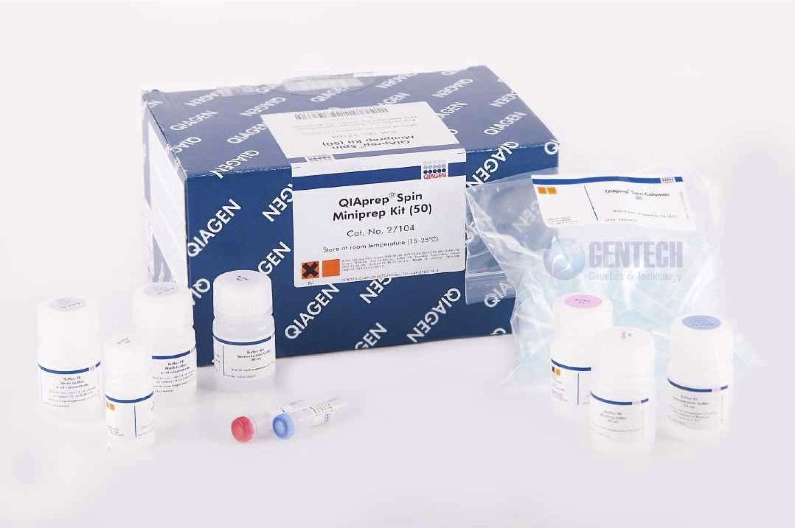
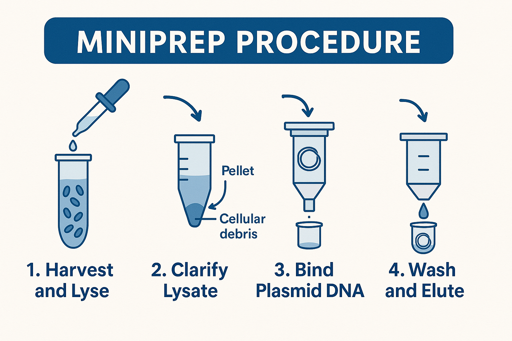

# Miniprep: Plasmid DNA Purification

Once you’ve picked and grown up an isolated colony, you now have a saturated culture containing billions of identical cells. Each cell carries multiple copies of the plasmid, and a miniprep allows you to extract and purify that plasmid DNA.

---

## Why Miniprep?

1. **Storage** — Purified plasmid can be stored at -20°C indefinitely.
2. **DNA as a Building Block** — You often need clean DNA to build or clone further constructs.
3. **Sequencing** — Verifying the plasmid sequence requires pure template.
4. **Transformation into Other Cells** — Requires isolated DNA.
5. **General Use** — Quantification, restriction mapping, and other analytical methods.

---

## Overview

*Figure: Components of the Qiagen QIAprep Spin Miniprep Kit. Blue columns, labeled buffers, and RNase A tube shown.*

This procedure is similar to the Zymo cleanup, but starts with a bacterial culture. We use the **Qiagen QIAprep Spin Miniprep Kit**, which uses silica column purification via **guanidinium-silica chemistry**. (This is **not** interchangeable with Qiagen anion-exchange kits.)

---

The protocol below is adapted from Qiagen's handbook, which includes detailed guidance, reagent preparation, and troubleshooting.  
📄 [Download the full handbook (PDF)](../assets/HB-1206-007_HB_QIAprep_Miniprep_1220_WW.pdf)

## The Qiagen Miniprep Procedure

*Figure: Overview of the miniprep workflow — cells are lysed, debris is removed, DNA binds to a spin column, and is then washed and eluted.*

### 🧪 Reagents

- **P1 Buffer** (with RNase A)
- **P2 Buffer** (NaOH/SDS)
- **N3 Buffer** (Acidic, with guanidinium)
- **PB Buffer** (protein/endotoxin removal)
- **PE Buffer** (70% ethanol)
- **EB Buffer** (elution)

### 🧫 Alkaline Lysis

1. **Pellet** 1–5 mL saturated culture in a microcentrifuge tube.
2. **Resuspend** in 250 µL P1 (RNase A must be added).
3. **Lyse** by adding 250 µL P2, mix gently (do **not** vortex).
4. **Neutralize** with 350 µL N3. Invert to mix thoroughly.
5. **Spin** 5 min at max speed to pellet debris.

### 🧼 Column Binding and Wash

6. Transfer supernatant to a **blue QIAprep column**, spin 15 s.
7. Add 500 µL PB Buffer, spin.
8. Add 750 µL PE Buffer, spin.
9. Discard flowthrough, then **spin again** 90 s to dry.

### 💧 Elution

10. Place column in a new 1.5 mL microcentifuge tube. Add 50 µL EB (or water, pH 7–8.5) to center of membrane.
11. Spin 1 min to elute DNA.

*Note: Avoid ethanol contamination from PE — spin thoroughly before eluting.*

---

## Lab Sheet Notes

- Clearly label both the top and side of each tube with clone ID (e.g. `pP6-79A`).
- Store the labeled miniprep tubes in the `minis1` box.
- Record **miniprep location** in the box (e.g., `E3`) on your lab sheet.
- Minipreps are retained for future use and must be properly inventoried.

---

## Kit Notes

- Add **RNase A** to P1 before use; store in the fridge thereafter.
- Add **ethanol** to PE buffer before first use. Waft the open tube to confirm ethanol has been added. A checkmark on the cap typically indicates ethanol has been added.
- P2 buffer may precipitate when cold; ensure it is a clear liquid before use. Gently warm it (e.g., in the microwave) to fully dissolve any precipitate.
- Buffers P2, N3, and PB contain irritants — wear gloves, goggles, and labcoat (as always).
- Be mindful of contamination on your gloves. This procedure can be messy; crusty debris from bottle rims can transfer to gloves and contaminate your samples. Rinse your gloves at the sink if you suspect it.

---

## Video Tutorial

🎥 Watch the tutorial video before lab to familiarize yourself with the miniprep steps.  
<iframe width="560" height="315" src="https://www.youtube.com/embed/gKHO0HHPsXg" frameborder="0" allowfullscreen></iframe>
