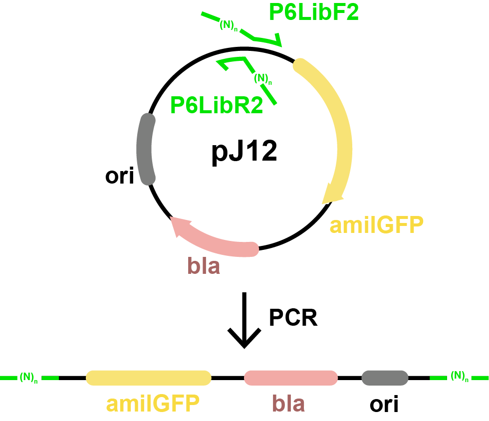

<script src="https://unpkg.com/seqviz"></script>
# Polymerase Chain Reaction

In this step, you’ll perform a PCR reaction to generate a pool of DNA molecules, each containing a different variant of a synthetic promoter.

This protocol uses **PrimeSTAR GXL DNA Polymerase** and the **PG4K55** thermal cycler program. You’ll use degenerate primers that introduce many random bases, meaning each DNA product will contain a different promoter sequence that nobody has created before you.

---

## What You’re Doing

In this step, you're performing an EIPCR (Error-prone Inverse PCR) reaction using the plasmid **pJ12** as a template. The goal is to replace the weak promoter in pJ12 with a library of randomized sequences using specially designed degenerate primers.

This reaction produces a linear ~3.6 kb PCR product with terminal BsaI sites, which will later be closed into a circular plasmid by Golden Gate assembly.

### Primers Used

These primers introduce BsaI sites and randomized sequence regions:

#### Forward Primer (P6LibF2)

<div id="viewer_fwd"></div>
<script>
  function waitForSeqViz(callback) {
    if (typeof seqviz !== "undefined" && seqviz.Viewer) {
      callback();
    } else {
      setTimeout(() => waitForSeqViz(callback), 50);
    }
  }

  waitForSeqViz(() => {
    seqviz
      .Viewer("viewer_fwd", {
        "name": "P6LibF2",
        "seq": "CAGTAggtctcgATAATNNNNNNANNNNGTTAGTATTTCTCCTCGTCTAC",
        "annotations": [
          { "name": "BsaI", "start": 5, "end": 11, "color": "lime", "direction": 1 },
          { "name": "Sticky End", "start": 12, "end": 16, "color": "pink", "direction": 1 },
          { "name": "-10 (partial)", "start": 12, "end": 17, "color": "cream", "direction": 1 },
          { "name": "Randomized", "start": 17, "end": 23, "color": "cyan" },
          { "name": "+1", "start": 23, "end": 24, "color": "red" },
          { "name": "Randomized", "start": 24, "end": 28, "color": "cyan" },
          { "name": "Annealing", "start": 28, "end": 50, "color": "orange" }
        ],
        "translations": [],
        "viewer": "linear",
        "showComplement": false,
        "showIndex": true,
        "style": { "height": "120px", "width": "100%" }
      })
      .render();
  });
</script>

#### Reverse Primer (P6LibR2)

<div id="viewer_rev"></div>
<script>
  waitForSeqViz(() => {
    seqviz
      .Viewer("viewer_rev", {
        "name": "P6LibR2",
        "seq": "CCAAAGGTCTCGTTATANNNNNNNNNNNNNNNNNTGTCAANNNNGAACCCAGGACTCCTCGAAGTC",
        "annotations": [
          { "name": "BsaI", "start": 5, "end": 11, "color": "lime", "direction": 1 },
          { "name": "Sticky End", "start": 12, "end": 16, "color": "pink", "direction": -1 },
          { "name": "-10 (partial)", "start": 12, "end": 17, "color": "cream", "direction": -1 },
          { "name": "Randomized", "start": 17, "end": 34, "color": "cyan" },
          { "name": "Annealing", "start": 44, "end": 66, "color": "orange" },
          { "name": "-35", "start": 34, "end": 40, "color": "cream" , "direction": -1},
          { "name": "Randomized", "start": 40, "end": 44, "color": "cyan" }
        ],
        "translations": [],
        "viewer": "linear",
        "showComplement": false,
        "showIndex": true,
        "style": { "height": "120px", "width": "100%" }
      })
      .render();
  });
</script>



*Figure: This experiment uses PCR to amplify the entire pJ12 plasmid using primers that face outward and include BsaI sites with degenerate bases. The result is a linear PCR product that still contains all original plasmid features (amilGFP, bla, ori), flanked by randomized promoter regions near each end.*

The lowercase `ggtctc` sequence in each primer is the recognition site for the BsaI enzyme. This allows the PCR product to be seamlessly ligated back into a circular plasmid in a later step.

### PCR Product Map (Annotated)

<div id="viewer_plasmid"></div>
<script>
  waitForSeqViz(() => {
    seqviz
      .Viewer("viewer_plasmid", {
        "name": "P6 PCR Product",
        "seq": "CAGTAggtctcgATAATNNNNNNANNNNGTTAGTATTTCTCCTCGTCTACGGTTAACTGATACTCCCTAATACAGGAGATACTAGATGTCTTATTCAAAGCATGGCATCGTACAAGAAATGAAGACGAAATACCATATGGAAGGCAGTGTCAATGGCCATGAATTTACGATCGAAGGTGTAGGAACTGGGTACCCTTACGAAGGGAAACAGATGTCCGAATTAGTGATCATCAAGCCTGCGGGAAAACCCCTTCCATTCTCCTTTGACATACTGTCATCAGTCTTTCAATATGGAAACCGTTGCTTCACAAAGTACCCGGCAGACATGCCTGACTATTTCAAGCAAGCATTCCCAGATGGAATGTCATATGAAAGGTCATTTCTATTTGAGGATGGAGCAGTTGCTACAGCCAGCTGGAACATTCGACTCGAAGGAAATTGCTTCATCCACAAATCCATCTTTCATGGCGTAAACTTTCCCGCTGATGGACCCGTAATGAAAAAGAAGACCATTGACTGGGATAAGTCCTTCGAAAAAATGACTGTGTCTAAAGAGGTGCTAAGAGGTGACGTGACTATGTTTCTTATGCTCGAAGGAGGTGGTTCTCACAGATGCCAATTTCACTCCACTTACAAAACAGAGAAGCCGGTCACACTGCCCCCGAATCATGTCGTAGAACATCAAATTGTGAGGACCGACCTTGGCCAAAGTGCAAAAGGCTTTACAGTCAAGCTGGAAGCACATGCCGCGGCTCATGTTAACCCTTTGAAGGTTAAATAAGTTCCGGTGGAGCTCCAGCTTTTGTTCCCTTTAGTGAGGGTTAATTGCGCGCTTGGCGGCCGGCTTATCGGTCAGTTTCACCTGATTTACGTAAAAACCCGCTTCGGCGGGTTTTTGCTTTTGGAGGGGCAGAAAGATGAATGACTGTCCACGACGCTATACCCAAAAGAAATGTTCATGGTCATAGCTGTTTCCTGTGTGGTGGTAGATCCTCTACGCCGGACGCATCGTGGCCGGCATCACCGGCGCCACAGGTGCGGTTGCTGGCGCCTATATCGCCGACATCACCCAGAAATCATCCTTAGCGAAAGCTAAGGATTTTTTTTATCTGAAATTCTGCCTCGTGATACGCCTATTTTTATAGGTTAATGTCATGATAATAATGGTTTCTTAGACGTCAGGTGGCACTTTTCGGGGAAATGTGCGCGGAACCCCTATTTGTTTATTTTTCTAAATACATTCAAATATGTATCCGCTCATGAGACAATAACCCTGATAAATGCTTCAATAATATTGAAAAAGGAAGAGTATGAGTATTCAACATTTCCGTGTCGCCCTTATTCCCTTTTTTGCGGCATTTTGCCTTCCTGTTTTTGCTCACCCAGAAACGCTGGTGAAAGTAAAAGATGCTGAAGATCAGTTGGGTGCACGAGTGGGTTACATCGAACTGGATCTCAACAGCGGTAAGATCCTTGAGAGTTTTCGCCCCGAAGAACGTTTTCCAATGATGAGCACTTTTAAAGTTCTGCTATGTGGCGCGGTATTATCCCGTATTGACGCCGGGCAAGAGCAACTCGGTCGCCGCATACACTATTCTCAGAATGACTTGGTTGAGTACTCACCAGTCACAGAAAAGCATCTTACGGATGGCATGACAGTAAGAGAATTATGCAGTGCTGCCATAACCATGAGTGATAACACTGCGGCCAACTTACTTCTGACAACGATCGGAGGACCGAAGGAGCTAACCGCTTTTTTGCACAACATGGGGGATCATGTAACTCGCCTTGATCGTTGGGAACCGGAGCTGAATGAAGCCATACCAAACGACGAGCGTGACACCACGATGCCTGTAGCAATGGCAACAACGTTGCGCAAACTATTAACTGGCGAACTACTTACTCTAGCTTCCCGGCAACAATTAATAGACTGGATGGAGGCGGATAAAGTTGCAGGACCACTTCTGCGCTCGGCCCTTCCGGCTGGCTGGTTTATTGCTGATAAATCTGGAGCCGGTGAGCGTGGCTCTCGCGGTATCATTGCAGCACTGGGGCCAGATGGTAAGCCCTCCCGTATCGTAGTTATCTACACGACGGGGAGTCAGGCAACTATGGATGAACGAAATAGACAGATCGCTGAGATAGGTGCCTCACTGATTAAGCATTGGTAATTTTTTTAAGGCAGTTATTGGTGCCTACTATGGAACTGCCTCGGTGAGTTTTCTCCTTCATTACAGAAACGGCTTTTTCAAAAATATGGTATTGATAATCCTGATATGAATAAATTGCAGTTTCATTTGATGCTCGATGAGTTTTTCTAACTGAACTCTTTACAAATCTAAAATGTTTGTGACTGTATTATAAGAACAGAAATCCCCCTTACACGGAGGCATCAGTGACCAAACAGGAAAAAACCGCCCTTAACATGGCCCGCTTTATCAGAAGCCAGACATTAACGCTTCTGGAGAAACTCAACGAGCTGGACGCGGATGAACAGGCAGACATCTGTGAATCGCTTCACGACCACGCTGATGAGCTTTACCGCAGCTGCCTCGCGCGTTTCGGTGATGACGGTGAAAACCTCTGACACATGCAGCTCCCAGCAAAAGGCCAGGAACCGTAAAAAGGCCGCGTTGCTGGCGTTTTTCCATAGGCTCCGCCCCCCTGACGAGCATCACAAAAATCGACGCTCAAGTCAGAGGTGGCGAAACCCGACAGGACTATAAAGATACCAGGCGTTTCCCCCTGGAAGCTCCCTCGTGCGCTCTCCTGTTCCGACCCTGCCGCTTACCGGATACCTGTCCGCCTTTCTCCCTTCGGGAAGCGTGGCGCTTTCTCATAGCTCACGCTGTAGGTATCTCAGTTCGGTGTAGGTCGTTCGCTCCAAGCTGGGCTGTGTGCACGAACCCCCCGTTCAGCCCGACCGCTGCGCCTTATCCGGTAACTATCGTCTTGAGTCCAACCCGGTAAGACACGACTTATCGCCACTGGCAGCAGCCACTGGTAACAGGATTAGCAGAGCGAGGTATGTAGGCGGTGCTACAGAGTTCTTGAAGTGGTGGCCTAACTACGGCTACACTAGAAGGACAGTATTTGGTATCTGCGCTCTGCTGAAGCCAGTTACCTTCGGAAAAAGAGTTGGTAGCTCTTGATCCGGCAAACAAACCACCGCTGGTAGCGGTGGTTTTTTTGTTTGCAAGCAGCAGATTACGCGCAGAAAAAAAGGATCTCAAGAAGATCCTTTGATCTTTTCTACGGGGTCTGACGCTCAGTGGAACGAAAACTCACGTTAAGGGATTTTGGTCATGAGATTATCAAAAAGGATCTTCACCTAGATCCTTCGATTACCGCCTTTGAGTGAGCTGATACCGCTCGCCGCAGCCGAACGACCGAGCGCAGCGAGTCAGTGAGCGAGGAAGCCTGCAATGTCTGCCACGTATCGCCAGATGTTCCAGACTAGAATAAAGAAAAAGGGAGCCCATGGGCTCCCTTAATTTAAAATGGTTGTCTTAAGAACGACTTCGAGGAGTCCTGGGTTCNNNNTTGACANNNNNNNNNNNNNNNNNTATAAcgagaccTTTGG",
        "annotations": [
          { "name": "BsaI", "start": 5, "end": 11, "color": "lime", "direction": 1 },
          { "name": "Sticky End", "start": 12, "end": 16, "color": "pink", "direction": 1 },
          { "name": "-10 (partial)", "start": 12, "end": 17, "color": "cream", "direction": 1 },
          { "name": "Randomized", "start": 17, "end": 23, "color": "cyan" },
          { "name": "+1", "start": 23, "end": 24, "color": "red" },
          { "name": "Randomized", "start": 24, "end": 28, "color": "cyan" },
          { "name": "Annealing", "start": 28, "end": 50, "color": "orange" },
          { "name": "amilGFP", "start": 85, "end": 781, "color": "#ffef13", "direction": 1 },
          { "name": "rnpB T1", "start": 840, "end": 953, "color": "#ff8040", "direction": 1 },
          { "name": "terminator", "start": 1072, "end": 1116, "color": "#D56B5B", "direction": -1 },
          { "name": "CA998", "start": 1109, "end": 1131, "color": "#9bd1f9", "direction": -1 },
          { "name": "Pbla (PMID: 6269053)", "start": 1238, "end": 1293, "color": "#66ccfe", "direction": 1 },
          { "name": "Bla", "start": 1310, "end": 2171, "color": "#ff9c93", "direction": 1 },
          { "name": "ROP", "start": 2395, "end": 2587, "color": "#ff8040", "direction": 1 },
          { "name": "ColE1 origin", "start": 2626, "end": 3309, "color": "gray", "direction": -1 },
          { "name": "G00101", "start": 3343, "end": 3363, "color": "#99e4fb", "direction": 1 },
          { "name": "T4 terminator", "start": 3461, "end": 3503, "color": "LightCoral", "direction": 1 },
          { "name": "Annealing", "start": 3517, "end": 3539, "color": "orange" },
          { "name": "Randomized", "start": 3539, "end": 3543, "color": "cyan" },
          { "name": "-35", "start": 3543, "end": 3549, "color": "cream", "direction": 1 },
          { "name": "Randomized", "start": 3549, "end": 3566, "color": "cyan" },
          { "name": "-10 (partial)", "start": 3566, "end": 3571, "color": "cream", "direction": 1 },
          { "name": "Sticky End", "start": 3567, "end": 3571, "color": "pink", "direction": 1 },
          { "name": "BsaI", "start": 3572, "end": 3578, "color": "lime", "direction": -1 }
        ],
        "translations": [],
        "viewer": "linear",
        "showComplement": false,
        "showIndex": true,
        "style": { "height": "400px", "width": "100%" }
      })
      .render();
  });
</script>

---

## 🧾 Reading the Lab Sheet

The PCR lab sheet has labeled fields you must fill in with the aliquot tube numbers you actually use. This is important for tracking which reactions were set up with which materials.

| Reagent       | Label | Concentration | Location       |
|---------------|-------|---------------|----------------|
| Primer (F)    | F#    | 10 μM         | Training1/A*   |
| Primer (R)    | R#    | 10 μM         | Training1/B*   |
| Template (pJ12) | T#  | dil 20×       | Training1/C*   |

- Fill in the tube number used for each reagent.
- Write in which thermocycler you used.
- Record the product band size after gel (see next section).

---

## 🔬 The PCR Program

We use the **PG4K55** program on the thermocycler, designed for ~4 kb products with a 55°C annealing step.

```
Initial Denaturation:   98°C for 2 min
30 cycles:
  Denaturation:         98°C for 10 sec
  Annealing:            55°C for 15 sec
  Extension:            68°C for 4 min
Final Extension:        68°C for 5 min
```

---

## ✅ What to Expect

- You should see a clear band at ~3583 bp on a gel.
- If there’s no band, double-check which primers and template you used.

---

## 🎥 Watch Before Lab

Watch the PCR tutorial video: **pP6-2022-1-PCR** (available on bCourses) before coming to lab.
