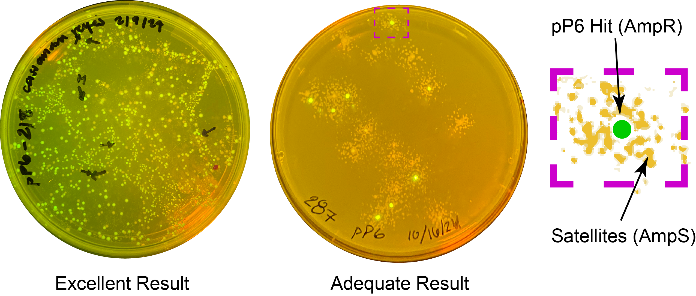
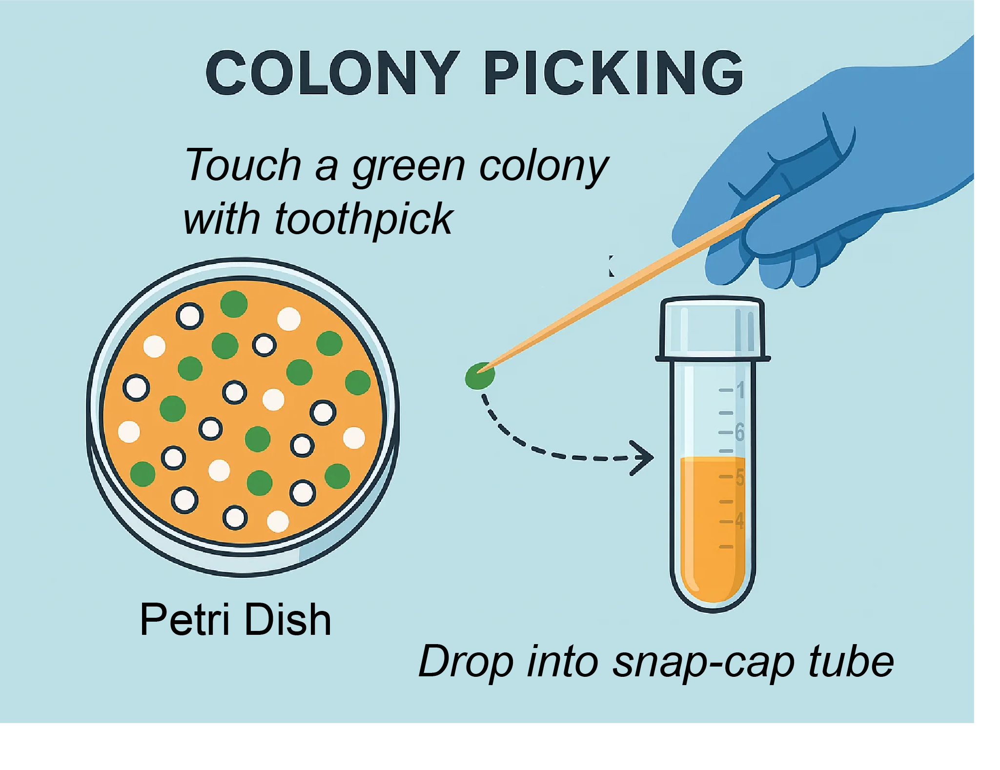

# Colony Picking

After plating your transformation and incubating overnight, if everything goes well you will see colonies that look something like this:

*Figure: Results from two students' pP6 transformations under blue light illumination to excite amilGFP. Left: an ideal plate with many green colonies. Right: a minimally usable plate. The zoomed region shows a green colony (a true pP6 transformant) surrounded by smaller white "satellite colonies"—non-transformed cells growing in an antibiotic-depleted zone. Only the green colony contains the plasmid and is ampicillin-resistant.*

---

## What Are You Looking For?

In the pP6 experiment, you're trying to identify the **strongest promoter variants**. These drive expression of amilGFP, which fluoresces green.  

- **Bright green colonies** indicate successful assembly of a strong promoter driving GFP.  
- Colonies with no fluorescence are likely the template plasmid (pJ12) or inactive variants.

Some bright colonies are so strong that you can see yellowish color even without blue light. These are your best candidates.

Each visible spot on the plate arises from a single bacterium that landed there and divided repeatedly. To ensure you're picking a true single clone, choose **well-isolated, round colonies** that are clearly separated from their neighbors.  

- Avoid picking colonies that are touching or very close together  
- Avoid elongated or smeared colonies, which may indicate mixed or unhealthy growth  

**Picking** refers to using a sterile tool (usually a toothpick or pipette tip) to transfer a single colony to a liquid culture.  
**Inoculating** means introducing that colony into fresh media to grow overnight.
---

*Figure: Use a sterile toothpick to gently touch a green colony, then inoculate 4 mL of media by dropping the toothpick into a labeled snap-cap tube.*

---

## Protocol

Follow your lab sheet and the steps below:

**Step 1:** Identify the brightest green colonies under blue light and mark them on the plate.

**Step 2:** Label snap-cap tubes for up to 4 clones with your assigned ID number and a letter. For example:  
`pP6-79A`, `pP6-79B`, etc.

**Step 3:** Add 4 mL of 2YT + Carb (from fridge) into each tube.

**Step 4:** Pick each marked colony using a sterile toothpick and inoculate it by dropping the toothpick directly into the labeled tube (do not remove the toothpick).

**Step 5:** Cover the tube and grow in the shaking incubator overnight.

**Step 6:** Wrap the agar plate with parafilm and place it upside-down in the fridge for recordkeeping.

**Step 7:** Upload a photo of your plate under blue light to this folder:  
[Google Drive Folder](https://drive.google.com/drive/folders/1cumFECQCZbFkj-G1cFbsXqGeBUpqBo0D)  
Name the image as: `pP6-79` (with your number)

**Step 8:** Document your picks. Why did you choose each clone?  
(e.g., "very green and slow growing")

---

## Example

| clone_id | why was it chosen?                  |
|----------|-------------------------------------|
| 79A      | It was exceptionally green and slow growing |
| 79B      | Brightest colony on the plate       |

---

## Video Tutorial

🎥 Watch the picking tutorial video before lab.  
<iframe width="560" height="315" src="https://www.youtube.com/embed/gKHO0HHPsXg" frameborder="0" allowfullscreen></iframe>
