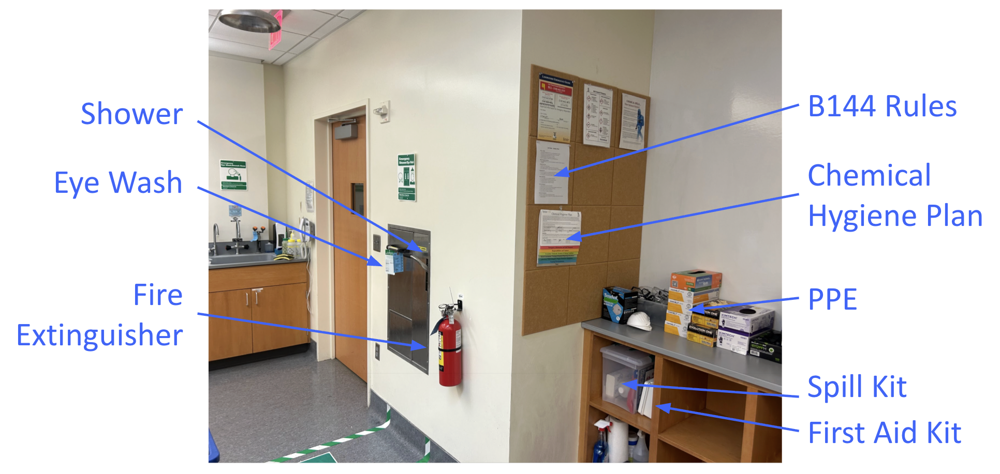
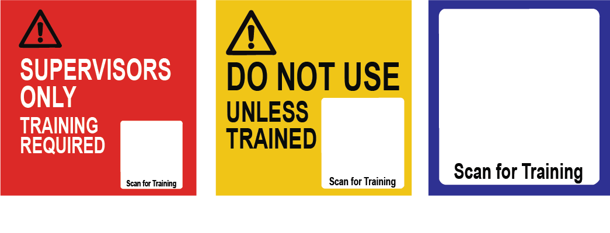

# Wetlab Safety Training (B144 Stanley)

This tutorial covers the basic safety rules for students working in B144 Stanley. You must review these rules, follow them at all times, and complete the quiz.

For the full list of lab rules, see the [Lab Rules – B144 Stanley (PDF)](../assets/Lab_Rules_B144_Stanley.pdf). A printed copy is posted in the Safety Corner.

---

## General Conduct

- No food or drink in the lab.
- Only enter B144 when a supervisor (facilitator or instructor) is present.
- Only work on projects that have been authorized by your instructor/PI.
- Do not bring materials in or out of the lab unless explicitly authorized.
- This lab is **BSL1 only**: no infectious agents, sharps, or hazardous chemicals.

---

## Personal Protective Equipment (PPE)
- Required at all times:
  - Closed-toe shoes and long pants
  - Lab coat
  - Gloves
  - Eye protection (prescription glasses are acceptable)
- PPE is available in designated locations in the room.

---

## Safety Equipment and Emergencies

The **Safety Corner** is located by the north door, near the biosafety cabinets on the mammalian cell side of the room. This area contains the emergency and safety supplies you may need during lab sessions.

**What is in the Safety Corner**

- Safety shower
- Eye wash
- Fire extinguisher
- PPE (gloves, lab coats, eye protection)
- Spill kit
- First-aid kit
- Chemical Hygiene Plan and other emergency information

**Safety Shower and Eye Wash**  

- Located by the biohood-side door.  All safety-related materials are in this corner.
- If exposed to chemicals, flush eyes thoroughly for **15 minutes**.

**Fire Extinguisher**  

- Located by the biohood-side door.  
- Ensure you know how to operate it safely.

**Emergency Procedures**  

- Notify your supervisor immediately of any spill or injury.  
- Call **911** for life-threatening emergencies.  
- If evacuation is required, proceed to the **Mining Circle**.

---

## Common Lab Hazards
- **Microwave**: beware of superheated agar or liquids that can cause burns.
- **Bunsen burner**: fire hazard, especially with ethanol-based solutions.
- Never spray ethanol near an open flame.

---

## Equipment Use and Signage
Certain equipment and cabinets are marked with signage to indicate who may use them and under what conditions. Always follow these signs. If in doubt, ask your supervisor before using the equipment.

- **Supervisors Only** – Students must not touch or use this equipment.
- **Training Required** – Students may use this equipment, but only after completing the required training. Follow the QR code on the sign to access the training.
- **Training Available** – Training is available for this instrument. If you don’t know how to use it, scan the QR code for assistance.

---

## Cleanup and Records
- Clean your bench with 70% ethanol and restore it to its default organization after each session.
- Dispose of research materials including gloves in the large white bin or benchtop plastic beakers.
- Maintain accurate records of all experiments as directed by your instructor.

---

## Compliance
- Follow all University policies, including COVID-19 mitigation and emergency response.
- Failure to follow these rules may result in loss of access to the lab.

---

# Quiz

<em>Answer all questions correctly to pass. If you miss any, the quiz resets with a new randomized set.</em>

  <button type="button" id="safety_check_btn">Check Answers</button>
  <button type="button" id="safety_reset_btn">Reset</button>
  

