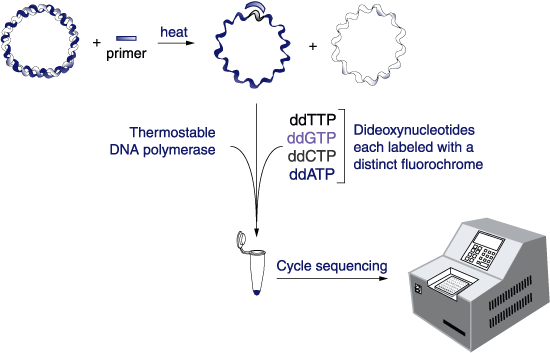
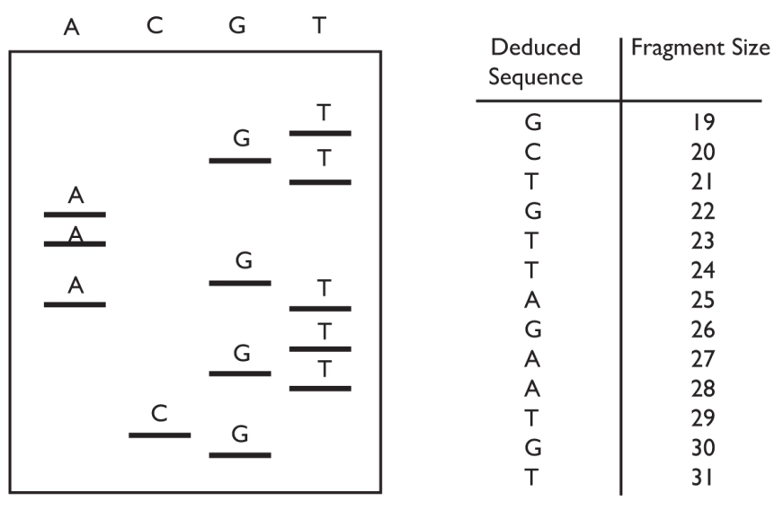

# Cycle Sequencing

After you’ve picked colonies and completed your minipreps, you’ve finished the fabrication phase. The next question: **what did you actually make?** This tutorial will guide you through how to determine if your plasmid contains the correct sequence.

---

## What Is Cycle Sequencing?

Cycle sequencing, also often called Sanger sequencing, uses DNA polymerase and chain-terminating nucleotides (ddNTPs) to create truncated DNA fragments, each ending in a labeled base. These fragments are then separated by capillary electrophoresis to reveal the DNA sequence.



*Figure: Cycle sequencing overview. Fluorescently-labeled ddNTPs stop extension at every base type. The resulting DNA fragments are separated and analyzed.*

---

## Why Not Just Sequence the Whole Plasmid?

Full-plasmid sequencing services (e.g., Plasmidsaurus) cost ~$15/sample and return the entire sequence. This is useful in some cases, but often overkill. In the pP6 experiment, we only care about a small variable region between two restriction sites. A single **cycle sequencing read** (~$3.50) is sufficient.

---

## Cycle Sequencing Details

In cycle sequencing, only **one primer** is used, which means the amplification is linear rather than exponential like in PCR. The read typically starts about 20–50 bp downstream of the primer, and you'll usually get around 400–1000 bp of usable sequence, depending on the quality of the reaction.

Each ddNTP is fluorescently labeled with a distinct color. After PCR-like cycling, the products are run through capillary electrophoresis.


*Figure: Example of a traditional sequencing gel, where each lane contains fragments ending in a specific base. The band pattern reveals the sequence of the DNA strand. This image is adapted from [Edvotek’s excellent DNA sequencing tutorial](https://blog.edvotek.com/2014/09/08/understanding-dna-sequencing-part-1/), which we recommend if you’d like a deeper dive into how the chemistry works.*

---

## From Data to Interpretation

From the sequencing facility, you get:

- A `.txt` file containing the **base calls** (the 'read')
- An `.ab1` chromatogram file (shows raw fluorescent data), the 'trace'

You can view both in **ApE** or **Benchling**. ApE will also annotate known features if you hit `ctrl-K` with a feature database installed.

---

## Step-by-Step: How to Sequence Your pP6 Clone

### Choosing a Primer

The sequence you read will start ~20–50 bp **downstream** of your primer. So, you must choose a primer upstream of the region you want to check. For pP6, we use the standard primer **G00101**.

### When to Use Other Sequencing Options

| Method               | Cost/sample | Output                     | Use Case                          |
|----------------------|-------------|-----------------------------|-----------------------------------|
| Cycle sequencing     | ~$3.50      | ~1 kb from a primer         | Quick check of a region           |
| Full plasmid         | ~$15        | Entire plasmid              | Final confirmation, mutation scan |
| Deep sequencing      | $750+       | Millions of reads           | Libraries, high-throughput work   |

### What to Do With Your pP6 Sequencing Result

Once your sequencing data is returned (usually in 1–2 days), you will:

### 1. **Download your result**  

   - Search for your assigned number (e.g., `79`) in this shared folder:  
     [📂 pP6 Sequencing Data Folder](https://drive.google.com/drive/u/1/folders/1dxcms7KWnq2-J6WwLECXEPMLE03THW-Q)

### 2. **Check for the Expected pP6 Architecture**

Before comparing your entire sequence to the model, begin by checking for key features within your read:

#### 🔍 Step 1: Look for the BseRI → Promoter → BseRI Pattern

This is the core region you’re sequencing. You're looking for the structure:

```
BseRI → variable promoter region → BseRI
```

If this pattern is intact, your clone is a **candidate hit**. If not, it’s likely not usable, but it may still be worth investigating as an example of unexpected outcomes. Reads from this experiment sometimes contain odd duplications, deletions, or recombinations due to the N-rich promoter region.

#### 🧬 Step 2: Use ApE to Confirm Key Features

Open your `.seq` file and `pP6.seq` in **ApE**. You can download the model file here: [📄 pP6.seq](../assets/pP6.seq) If your feature database is installed, hit `ctrl-K` to light up key landmarks such as:

- **BseRI** restriction sites (you should see exactly 2)
- **consensus promoter pattern**: NNNNTTGACANNNNNNNNNNNNNNNNNTATAATNNNNNNANNNN
- **T4 terminator**

Use the feature list at the top of ApE to verify that all these landmarks are present, appear once, and are in the correct order.

#### 🧪 Step 3: Align the Read to the Model

To verify flanking sequence accuracy:
- Select your sequence in ApE
- Go to **Tools → Align with another sequence...**
- Choose `pP6.seq`
- Look for 100% identity near and around the promoter region

A clean alignment confirms no point mutations or context disruption.

#### ✅ Quick Checklist

- [ ] Contains two **BseRI** sites
- [ ] Includes the **UBER promoter** motif between them
- [ ] Promoter is not duplicated, reversed, or truncated
- [ ] Contains expected **T4 terminator** site
- [ ] Alignment shows clean sequence on both sides

Use this structure to decide if your clone is **usable** or just interesting. Add your findings to the worksheet in the next step.

### 3. **Confirm if your clone is a good read**  

- Is the read **clean**, free of noise or ambiguous calls?
- How **long** is the high-quality portion with no N's — 100 bp (low quality), 800 bp (good), 1000 bp (great)?

A high-quality read should give you several hundred bases of clean, mappable sequence. The more of the surrounding context you can confirm, the better.

### 4. **Search for the target motif**  

   - Look for this key motif in your read:
     ```
     GAGGAGTCCTGGGTTCNNNNTTGACANNNNNNNNNNNNNNNNNTATAATNNNNNNANNNNGTTAGTATTTCTCCTC
     ```
   - If it's found and the read is clean, mark your clone as **usable**.

### 5. **Fill out the worksheet**

Go to:  
[📝 pP6 Clones Worksheet](https://docs.google.com/spreadsheets/d/1ExKaK8UAiROHywp3qwYDxm3X3QABuKrNPL5QQScM6uA/edit?usp=sharing)

For each clone that has a clean and analyzable read, enter the following information:

- **clone_id** — Your assigned clone label (e.g., `79A`)
- **read_name** — The filename of your `.seq` file (e.g., `62-pP6-14B_F08_054.seq`)
- **date_sequenced** — The name of the sequencing folder (e.g., `2022_04_24`)
- **canonical** — Mark **"yes"** if the read matches the model sequence (`pP6.seq`) across the entire promoter region with no mutations or rearrangements. Otherwise, **"no"**.
- **usable** — Mark **"yes"** if the expected UBER promoter motif is found and intact, even if the rest of the plasmid has issues. Otherwise, **"no"**.
- **cassette** — Paste the actual sequence you matched that corresponds to the expected promoter region.
- **Notes** — Summarize what you observed.

#### 🧪 Example Annotations

| clone_id | canonical | usable | cassette | Notes |
|----------|-----------|--------|----------|-------|
| 14A      | yes       | yes    | GAGGA...CTC | Perfect match |
| 14B      | no        | no     |          | Pcon region is shortened, no UBER present |
| 14C      | no        | yes    | GAGGA...CTC | Additional BseRI sites included, but Pcon site is fine |
| 14D      | no        | no     |          | Contamination, matches pTP1 |
| 14E      | no        | yes    | GAGGA...CTC | Extra BseRI and BsaI sites, but promoter is fine |

Remember: **usable** means the promoter is intact and could be moved forward into our development pipeline. **Canonical** means it's a perfect match to what we designed.

You don’t need perfection to keep a clone — but you do need to understand it.

### 6. **Close out the experiment** with your supervisor  

   - Discard cleanup DNA and used plates
   - Discard clones with bad reads
   - Clean and bleach culture block
   - Confirm image/data uploads
   - Move good clones ("hits") to TPcon6B box
   - Your pP6 work is **complete** when hits are logged and uploaded

🎉 That’s it! You’ve finished the pP6 experiment!

But there's one final question: we know the promoter works and we've seen that it's green — but how strong is it, exactly?

The pP6 hits you've found vary a lot in brightness. To move from a qualitative observation ("looks bright") to a quantitative measurement, your next tutorial — **BestP** — will walk you through how to assess promoter strength using fluorescence activity assays.

---

## 🎥 Watch Before Lab

Watch the Sequencing tutorial video before coming to lab.
<iframe width="560" height="315" src="https://www.youtube.com/embed/gKHO0HHPsXg" frameborder="0" allowfullscreen></iframe>
